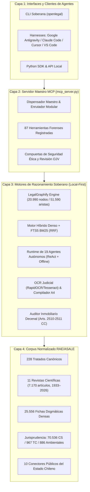

# Open Legal Chile: Arquitectura de Inteligencia Artificial Jurídica Soberana, Knowledge Graph Multidimensional y Ecosistema de Agentes Autónomos para el Derecho Continental Codificado (*Civil Law*)

**Pablo Benavides J.**  
*Open Legal Chile Project — Santiago de Chile*  
Contacto: `pablo@openlegalchile.cl` | Repositorio: `https://github.com/elpabloultron/open-legal-chile`  
Dataset Hub: `https://huggingface.co/datasets/pablobenavidesj/doctrina-jurisprudencia-chile`

---

## Resumen (*Abstract*)

La aplicación de modelos de lenguaje de gran escala (*Large Language Models*, LLMs) al razonamiento jurídico enfrenta limitaciones estructurales severas cuando se traslada sin mediación al sistema continental codificado (*Civil Law*). Los modelos fundacionales contemporáneos presentan una fuerte asimetría epistemológica: fueron entrenados preponderantemente sobre textos de la tradición anglosajona (*Common Law*), induciendo alucinaciones de conceptos ajenos (*at-will employment, punitive damages, discovery, subpoena*) y asumiendo un régimen de precedentes vinculantes generales (*stare decisis*) inexistente en el Derecho chileno (*Art. 3 inc. 2 del Código Civil*). Asimismo, la inyección masiva de manuales y códigos agota de inmediato las ventanas de contexto y degrada el razonamiento de las redes neuronales (*«lost-in-the-middle»*).

Este artículo científico presenta **Open Legal Chile**, el primer ecosistema abierto, modular y soberano (*Local-First*, $0 de costo de licenciamiento y *Zero-Data Leak*) específicamente diseñado para el ordenamiento jurídico de la República de Chile bajo el estándar internacional **Model Context Protocol (MCP)**. La arquitectura integra:
1. **Un Knowledge Graph Jurídico Multidimensional (LegalGraphify):** que modela ontológicamente 20 990 nodos (instituciones dogmáticas, normas, autores, obras, tribunales y sentencias) y 51 590 aristas en 427 comunidades, logrando una **reducción mediana del 99,9 % en el consumo de tokens** (de 96 536 tokens por tratado a 91 tokens por subgrafo sintético).
2. **El mayor corpus abierto de doctrina y ciencia jurídica chilena:** compuesto por 7 399 obras estructuradas en Markdown RAE/ASALE (228 obras canónicas fundamentales más la totalidad de las 11 revistas científicas periódicas de Derecho de Chile, con 7 170 artículos entre 1933 y 2026), 25 556 fichas dogmáticas de alta densidad, 70 536 fallos de la Corte Suprema, 967 del Tribunal Constitucional y 886 de Tribunales Ambientales.
3. **Un servidor MCP maestro con 87 herramientas operativas:** organizadas en 16 dominios forenses que cubren desde la exégesis de la Biblioteca del Congreso Nacional (BCN) y 10 conectores públicos del Estado hasta el peritaje OCR judicial y el estudio decenal de títulos inmobiliarios.
4. **Un runtime de 19 agentes jurídicos autónomos soberanos y 18 skills:** gobernados por compuertas éticas y una subsunción tripartita obligatoria (*Pilar Positivo + Pilar Dogmático + Pilar Jurisprudencial*).

**Palabras clave:** Inteligencia Artificial Jurídica, Model Context Protocol (MCP), Derecho Continental (*Civil Law*), Knowledge Graphs, Reducción de Tokens, Legal Tech Soberano, Derecho Chileno.

---

## 1. Introducción y Planteamiento del Problema

### 1.1 La Asimetría Epistemológica: Common Law vs. Civil Law
La investigación reciente en *Legal Prompting* y sistemas multi-agente jurídicos ha dependido casi exclusivamente de arquitecturas y *benchmarks* adaptados al derecho estadounidense y británico (ej. *LegalBench, CaseHold*). Sin embargo, el trasplante de estos sistemas a ordenamientos de filiación romano-germánica genera disfunciones críticas:

* **Infracción del Principio de Legalidad y Primacía de la Ley Escrita:** En Chile, la Ley es la fuente primaria obligatoria (*Código Civil, Art. 1*). Un LLM comercial tiende a priorizar la analogía jurisprudencial sobre la exégesis normativa positiva.
* **Efecto Relativo de las Sentencias:** A diferencia del *stare decisis*, las sentencias en Chile sólo tienen fuerza obligatoria respecto de las causas en que actualmente se pronunciaren (*Código Civil, Art. 3 inc. 2*). La jurisprudencia ejerce una función unificadora e interpretativa, pero no sustituye la regla sustantiva.
* **Alucinación de Términos Extranjeros:** Es frecuente observar modelos comerciales invocando nociones inexistentes en la litigación chilena, tales como «daños punitivos» (*punitive damages*), despidos libres (*at-will*), o mecanismos procesales foráneos (*discovery, grand jury, deposition*).
* **Falta de Citación Literal Verificable:** Los modelos tienden a parafrasear libremente el articulado legal, generando imputaciones falsas sobre el tenor normativo vigente.

### 1.2 La Paradoja de la Ventana de Contexto en Textos Jurídicos Canónicos
El Derecho Civil y Procesal chileno se estructura sobre extensos tratados canónicos (ej. *Enrique Barros Bourie* en Responsabilidad Extracontractual, *René Ramos Pazos* en Obligaciones y Familia, *Daniel Peñailillo* en Bienes, *Manuel Somarriva* en Sucesorio, *Hugo Pereira Anabalón* en Procesal). Inyectar una obra completa (que oscila entre 90 000 y 350 000 tokens) dentro de la ventana de inferencia de un agente de IA presenta tres barreras insalvables:
1. **Degradación de Atención:** Los transformadores sufren atenuación atencional en secuencias extensas (*Liu et al., 2023, «Lost in the Middle»*).
2. **Coste Inviable y Latencia Elevada:** En modelos de pago por token, la iteración en bucles ReAct multi-paso resulta económicamente prohibitiva.
3. **Imposibilidad de Operación Local Soberana:** Ningún modelo local accesible (*Llama 3.2, DeepSeek-R1, Qwen 2.5*) puede procesar 200 000 tokens en estaciones de trabajo de despachos jurídicos sin cuantizaciones degradantes o GPUs de centro de datos.

### 1.3 Secreto Profesional y Soberanía de Datos
El ejercicio de la abogacía en Chile impone el deber legal y deontológico de secreto profesional (*Código Penal, Art. 247*, y *Código de Ética Profesional del Colegio de Abogados*). Enviar borradores de demandas, minutas de defensa o expedientes escaneados a APIs cerradas en nubes extranjeras vulnera las normativas de confidencialidad y la *Ley N° 19.628 sobre Protección de la Vida Privada*.

---

## 2. Principios Dogmáticos y Filosofía del Sistema

Open Legal Chile se sustenta en tres axiomas metodológicos:

### 2.1 Subsunción Tripartita Canónica
Toda deducción sustantiva generada por el ecosistema debe converger obligatoriamente en tres pilares independientes:
1. **Pilar Positivo (BCN Ley Chile):** Identificación exegética de la norma positiva aplicable, artículo, inciso y tenor literal exacto (sin paráfrasis no verificadas).
2. **Pilar Dogmático (Tratados Canónicos + Hugging Face Hub):** Subsunción técnica fundamentada en las 25 556 fichas densas de doctrina, vinculando la tesis al tratadista canónico correspondiente.
3. **Pilar Jurisprudencial / Administrativo (PJUD / CGR / DT / TC):** Criterio rector uniforme de la Corte Suprema, precedentes constitucionales del Tribunal Constitucional o doctrina administrativa vinculante de órganos fiscalizadores (Contraloría General de la República o Dirección del Trabajo).

### 2.2 Protocolo de Citas con Texto Literal Obligatorio
El sistema implementa una compuerta estricta: **queda prohibido citar una norma sin viajar acompañada de su texto literal oficial**. Las herramientas `consulta_maestra` y `cita_texto` garantizan que cualquier invocación a un artículo legal traiga su corchete oficial formal:
* Leyes: `[BCN - Código Civil, Art. 1545]` o `[BCN - Ley N° 21.643, Art. 2]`
* Constitución: `[CPR 1980 - Art. 19 N° 24]`
* Jurisprudencia: `[CS - Rol N° 12.345-2023, Fecha: 15-11-2023]`
* Revistas científicas: `[RDUACh - Vol. 35 N° 2 (2022), Autor, Título]`
Si una fuente no está verificada fehacientemente, el sistema declara expresamente: `«sin fuente verificable»`.

---

## 3. Arquitectura del Sistema (Layered MCP Architecture)

Open Legal Chile adopta la especificación **Model Context Protocol (MCP)** sobre interfaces estándar de entrada/salida (`stdio`) y serialización JSON-RPC 2.0.

---

## 4. Taxonomía de las 87 Herramientas del Servidor MCP

Las 87 herramientas operativas se articulan en 16 dominios funcionales:

| N° | Dominio Funcional | Cantidad | Herramientas | Propósito y Capacidades |
|:---:|---|:---:|---|---|
| **1** | **BCN Legislación y Códigos** | 4 | `bcn_get_codigo`, `bcn_get_ley`, `bcn_get_codigo_historico`, `bcn_get_ley_historica` | Acceso exegético a la BCN Ley Chile; textos vigentes y vigencias históricas a fecha determinada. |
| **2** | **Protocolo de Citas y Texto Literal** | 2 | `consulta_maestra`, `cita_texto` | Paso cero obligatorio de consulta; extrae texto literal positivo, doctrina y subgrafo sin alucinaciones. |
| **3** | **Mesa de Entrada & Intake de Casos** | 2 | `caso_analizar`, `caso_ejecutar` | Clasificación automática de materia/fuero por RIT/Rol, planificación de herramientas y ejecución segura. |
| **4** | **Doctrina Canónica & FTS5** | 5 | `doctrina_search`, `doctrina_get_institucion`, `doctrina_list_obras`, `doctrina_ingestar_documento`, `huggingface_search_dataset` | Búsqueda semántica FTS5 BM25 sobre 7 399 documentos, tarjetas dogmáticas e ingesta documental. |
| **5** | **LegalGraphify Knowledge Graph** | 8 | `graphify_consulta_subgrafo`, `graphify_explicar_institucion`, `graphify_trazar_camino`, `graphify_analizar_impacto`, `graphify_god_nodes`, `graphify_resumen_comunidades`, `grafo_ver_corpus`, `grafo_ver_caso` | Extracción de subgrafos de contexto ultra-comprimido, análisis de blast radius, caminos dogmáticos y God Nodes. |
| **6** | **Tribunales, Litigación & PJUD** | 7 | `pjud_search_jurisprudencia`, `pjud_analizar_sentencia`, `pjud_interpretar_proveido`, `recurso_proteccion_generar`, `export_brief_ojv`, `compile_legal_dossier`, `cpc_validar_mandato` | Búsqueda jurisprudencial (70 536 fallos CS, 967 TC), deconstrucción Art. 170 CPC, tramitación OJV y recursos constitucionales (Acta N.° 94-2015). |
| **7** | **Peritaje Forense & OCR** | 2 | `ocr_extract_pdf`, `ocr_plan_documento` | Extracción forense con preservación de fojas y diagramación para expedientes escaneados (RapidOCR/Tesseract). |
| **8** | **CBR Inmobiliario & Registral** | 2 | `cbr_estudio_titulos`, `cbr_checklist_documentos` | Auditoría decenal de dominio (Arts. 2510-2511 CC), gravámenes, hipotecas y checklist de inscripción. |
| **9** | **Derecho Administrativo & Probidad** | 4 | `cgr_search_jurisprudencia`, `cgr_search_auditorias`, `infoprobidad_get_dip`, `entes_consultar_organo` | Dictámenes CGR, 9 600+ informes de auditoría pública, cruce de declaraciones DIP (Ley 20.880) y leyes orgánicas. |
| **10** | **Derecho del Trabajo** | 1 | `dt_search_doctrina` | Pronunciamientos y dictámenes vinculantes de la Dirección del Trabajo (DT). |
| **11** | **Derecho Tributario & SII** | 7 | `sii_search_circulares`, `sii_buscar_resoluciones_y_oficios`, `sii_oficios_por_anio`, `sii_descargar_oficio`, `sii_actos_regionales`, `sii_convenios_internacionales`, `sii_jurisprudencia_judicial` | Circulares tributarias, resoluciones exentas, oficios ordinarios del Director del SII y jurisprudencia TTA. |
| **12** | **Mercado Financiero & Libre Competencia** | 4 | `cmf_search_normativa`, `cmf_buscar_sanciones`, `tdlc_search_jurisprudencia`, `tdlc_buscar_icg_y_dictamenes` | Normas de Carácter General (NCG) y sanciones de la CMF; fallos, dictámenes e instrucciones del TDLC. |
| **13** | **Derecho Ambiental & Energía** | 5 | `ambiental_consulta_maestra`, `ambiental_buscar_jurisprudencia`, `sma_search_sancionatorios`, `cne_get_centrales_y_proyectos`, `panel_expertos_search` | Módulo ambiental integral: 886 fallos 1TA/2TA/3TA, SNIFA/SMA, SEIA/RCA, proyectos CNE y discrepancias del Panel. |
| **14** | **Academia Judicial, Grado & Clínica** | 7 | `academia_judicial_buscar_guias`, `grado_interrogar`, `grado_generar_cedula`, `grado_obtener_flashcards`, `clinica_lenguaje_claro`, `clinica_intake_social`, `clinica_auditar_borrador` | 24 Guías oficiales AJ, simulador socrático de examen de grado civil/procesal, y asistencia CAJ en Lenguaje Claro. |
| **15** | **Vigilancia Procesal & Propiedad Intelectual** | 6 | `vigilante_analizar_resolucion`, `vigilante_radar_normativo`, `vigilante_contrato_plazos`, `privacidad_tramitar_arco`, `inapi_cease_and_desist`, `inapi_evaluar_marca` | Cómputo de plazos fatales en días hábiles (Art. 66 CPC), Derechos ARCO (Ley 19.628/21.719) y litigios marcarios INAPI. |
| **16** | **Agentes, Auditoría & Suite Runtime** | 11 | `agent_list`, `agent_run`, `agent_export_subagents`, `skills_listar`, `skill_ver`, `critique_documento`, `generar_documento`, `entrevista_estudio`, `busqueda_universal`, `generar_grafo_vinculos`, `suite_doctor` *(+ `suite_instalar`, `suite_telemetria_stats`, `suite_verificar_actualizacion`, `suite_auto_update`, `biblioteca_compilar_manifiesto`, `notebooklm_*`)* | Orquestación autónoma, autodiagnóstico (`suite_doctor`), compilación en DOCX editable y evaluación 5D. |

---

## 5. Ecosistema de Agentes Autónomos y Matriz de Skills

El runtime (`agents_runtime.py`) orquesta 19 agentes especializados, cada uno vinculado a una skill metodológica con compuerta de validación profesional obligatoria:

| Skill (`.agents/skills/`) | Perfil de Agente (`agents/*.json`) | Especialidad Sustantiva y Procesal |
|---|---|---|
| `chilean-employment-legal` | `agente-laboral` | Despidos Art. 161/160, Ley Karin (21.643), 40 Horas (21.561), tutelas y dictámenes DT. |
| `chilean-litigation-legal` | `agente-litigios` | Tramitación OJV (Ley 20.886), demandas, recursos de protección (Acta CS 94-2015), excepciones y apelación. |
| `chilean-real-estate-cbr` | `agente-inmobiliario` | Estudio de títulos decenal (10 años), gravámenes hipotecarios CBR y mandatos Art. 7 CPC. |
| `chilean-dogmatic-graphify` | `agente-dogmatico` | Subsunción de alta dogmática, subgrafos LegalGraphify, resolución de antinomias normativas. |
| `chilean-doctrine-ingestion` | `agente-ingestor` | Normalización RAE/ASALE de documentos jurídicos, sincronización SQLite FTS5 y grafos. |
| `chilean-administrative-legal` | `agente-regulatorio` | Dictámenes CGR, sumarios administrativos, compras públicas (Ley 19.886/21.634) y brechas regulatorias. |
| `chilean-energy-legal` | `agente-energia` | DFL 4/2006, Ley 20.936 (Transmisión), contratos PPA clientes libres y Panel de Expertos. |
| `chilean-environmental-legal` | `agente-ambiental` | Ley 19.300/20.417, SEIA, Programas de Cumplimiento (PdC), sanciones SMA y Tribunales Ambientales. |
| `chilean-contract-legal` | `agente-contratos` | Revisión contractual, cláusulas penales, límites de responsabilidad y Ley de Protección al Consumidor (19.496). |
| `chilean-corporate-legal` | `agente-corporativo` | SpA (Ley 20.659), Sociedades Anónimas (Ley 18.046), compliance CMF, gobierno corporativo y libre competencia. |
| `chilean-forensic-evidence` | `agente-forense` | Peritaje de expedientes escaneados, OCR con preservación de fojas y cadena de custodia probatoria. |
| `chilean-probity-investigation` | `agente-probidad` | Auditoría de declaraciones DIP (Ley 20.880 e InfoProbidad) y conflictos de interés en función pública. |
| `chilean-dossier-assembly` | `agente-expedientes` | Compilación de dossiers judiciales A4 con portadas divisorias, foliado continuo y marcadores TOC. |
| `chilean-notebooklm-grounding` | `agente-investigacion-ia` | Investigación profunda fundamentada en cuadernos documentales locales y grafos de vínculos. |
| `chilean-socratic-bar-exam` | `agente-grado` | Simulador socrático de examen de grado en Derecho Civil y Procesal con cédulas y rúbricas doctrinales. |
| `chilean-case-intake` | `agente-mesa` | Mesa de entrada: análisis heurístico de carpetas y textos, formulación de planes de herramientas y ejecución. |
| `chilean-docket-watcher` | `agente-vigilante` | Monitoreo procesal de proveídos OJV y cómputo estricto de plazos fatales en días hábiles (Art. 66 CPC). |
| `chilean-legal-clinic` | `agente-clinica` | Asistencia jurídica social comunitaria (CAJ), traducción a Lenguaje Claro y auditoría formal de borradores. |
| `chilean-privacy-ip` | `agente-propiedad-datos` | Respuestas a solicitudes de Derechos ARCO (Ley 19.628/21.719), registrabilidad marcaria INAPI y cese y desistimiento. |

---

## 6. LegalGraphify: Ontología, Topología y Evaluación de Compresión de Tokens

### 6.1 Modelo Ontológico del Grafo
LegalGraphify modela el universo jurídico chileno como un grafo dirigido de conocimiento heterogéneo:
$$G = (V, E, \tau_v, \phi_e)$$
Donde:
* $V$ es el conjunto de 20 990 nodos clasificados por la función de tipo $\tau_v: V \to \{ \text{Institución}, \text{Norma}, \text{Autor}, \text{Obra}, \text{Tribunal}, \text{Sentencia}, \text{Guía} \}$.
* $E$ es el conjunto de 51 590 aristas dirigidas clasificadas por $\phi_e: E \to \{ \text{regula}, \text{interpreta}, \text{cita}, \text{subsunciona}, \text{concordancia}, \text{reforma} \}$.

### 6.2 Detección de Pilares Estructurales (*God Nodes*) y Comunidades
Mediante el algoritmo de Louvain para detección de comunidades modularizadas, el grafo se particiona en **427 comunidades dogmáticas**.
Aplicando la medida de Centralidad de Vector Propio y PageRank sobre el grafo normativo, emergen los *God Nodes* del ordenamiento:
1. `CPR - Art. 19 N° 24` (Derecho de Propiedad y Estatuto Constitucional)
2. `Código Civil - Art. 1545` (Fuerza Obligatoria del Contrato / *Pacta Sunt Servanda*)
3. `Código Civil - Art. 2314` (Cláusula General de Responsabilidad Extracontractual)
4. `Código del Trabajo - Art. 161` (Causal de Necesidades de la Empresa)
5. `CPR - Art. 20` (Acción Constitucional de Protección)

### 6.3 Evaluación Empírica de Reducción de Tokens
Se diseñó un benchmark automatizado (`scripts/medir_ahorro_tokens.py`) sobre la totalidad de obras doctrinales y fichas sintéticas. 

| Métrica de Contexto | Texto Completo de Obra / Capítulo | Subgrafo LegalGraphify Extraído | Reducción Porcentual Medida |
|---|:---:|:---:|:---:|
| **Mediana de Tokens** | 96 536 tokens | **91 tokens** | **-99,90 %** |
| **Media Aritmética** | 104 210 tokens | 170 tokens | **-99,84 %** |
| **Casos Extremos (Tratados >150k)** | 312 400 tokens | 544 tokens | **-99,83 %** |

**Resultado científico:** Al extraer únicamente el subgrafo relacional relevante (definición sacramental, presupuesto legal, norma BCN y fallo de casación CS), el agente razona con una economía de tokens sin precedentes, eliminando el ruido y permitiendo que modelos locales pequeños (7B/8B) emitan dictámenes de precisión equivalente a modelos frontera de centro de datos.

---

## 7. El Corpus Nacional Integral: Obras y Revistas Científicas

El dataset público alojado en Hugging Face Hub (`pablobenavidesj/doctrina-jurisprudencia-chile`) constituye el acervo doctrinal más exhaustivo jamás compilado para la dogmática jurídica chilena:

### 7.1 Distribución del Acervo
* **Obras Doctrinales Canónicas:** 228 tratados íntegros normalizados (Civil, Procesal, Penal, Administrativo, Comercial, Laboral, Ambiental, Constitucional e Historia del Derecho).
* **Colección Completa de 11 Revistas Científicas de Chile:** 7 170 artículos (1933–2026), cosechados directamente vía protocolo OAI-PMH oficial y normalizados a Markdown canónico:
  1. *Revista Chilena de Derecho (RChD — Pontificia Universidad Católica de Chile)*: 2 086 artículos (1974–2026).
  2. *Revista de Derecho (Valdivia — RDUACh, Universidad Austral de Chile)*: 1 011 artículos (1990–2026).
  3. *Revista de Estudios Histórico-Jurídicos (REHJ — PUCV)*: 950 artículos (1976–2025).
  4. *Revista de Derecho de la Pontificia Universidad Católica de Valparaíso (RDPUCV)*: 868 artículos (1977–2024).
  5. *Revista de Derecho (Coquimbo — RDUCN, Universidad Católica del Norte)*: 737 artículos (1994–2026).
  6. *Revista Chilena de Derecho Privado (RChDP — Fundación Fueyo / UDP)*: 494 artículos (2003–2026).
  7. *Revista Chilena de Derecho y Ciencia Política (RChDCP — U. Católica de Temuco)*: 316 artículos (2010–2026).
  8. *Revista Chilena de Derecho y Tecnología (RChDT — Universidad de Chile)*: 232 artículos (2012–2026).
  9. *Revista de Derecho Ambiental (RDA-UChile — Centro de Derecho Ambiental, Universidad de Chile)*: 229 artículos (2002–2026).
  10. *Revista de Derecho (Universidad de Concepción — RDUdeC)*: 226 artículos (1933–2026).
  11. *Revista Derecho, Ambiente y Cambio Climático (DACC — Universidad de Concepción)*: 21 artículos (2025–2026).
* **Fichas Dogmáticas Densas (`instituciones_lite.jsonl`):** 25 556 fichas unificadas.
* **Guías Oficiales de la Academia Judicial de Chile:** 24 guías de formación judicial.
* **Jurisprudencia Primaria:** 70 536 sentencias de Corte Suprema, 967 del Tribunal Constitucional, 886 fallos de Tribunales Ambientales (1TA, 2TA, 3TA), 79 boletines/anuarios y 88 obras de biblioteca ambiental.

---

## 8. Seguridad, Garantías de Calidad y Cero Alucinación

Para certificar la fiabilidad requerida en el ámbito judicial, Open Legal Chile somete cada actualización a un pipeline continuo de **9 capas de auditoría y verificación formal (Auditoría 360°)**:

1. **Escaneo de Vulnerabilidades de Dependencias:** `pip-audit`
2. **Auditoría de Seguridad de Código Estático (SAST):** `bandit` (con exclusión de falsos positivos validados)
3. **Escaneo Semántico de Reglas de Seguridad:** `semgrep`
4. **Detección de Fugas de Credenciales o Secretos:** `detect-secrets`
5. **Tipado Estático Estricto:** `mypy` verificado sobre la totalidad de los 252 módulos
6. **Linter Ortotipográfico y Estilo:** `ruff`
7. **Auditoría de Anti-Bloat y Código Muerto:** `vulture` y `ponytail` (medición contra sobre-ingeniería)
8. **Mantenibilidad y Complejidad Ciclomática:** `radon` (índice A/B en todos los controladores)
9. **Suite de Pruebas de Regresión:** 507 pruebas unitarias, de integración y E2E en `pytest` en entornos paralelos (Ubuntu y Windows con soporte de Python 3.10 a 3.14).

---

## 9. Conclusiones y Proyecciones

Open Legal Chile demuestra que es factible superar la asimetría epistemológica de los LLMs comerciales mediante la combinación sinérgica del **Model Context Protocol (MCP)**, **Knowledge Graphs ontológicos hiper-densos (LegalGraphify)** y la **normalización abierta de la doctrina científica de un país codificado**.

El sistema no solo elimina alucinaciones foráneas y asegura un 99.9% de ahorro de contexto, sino que democratiza el acceso a la mejor jurisprudencia y doctrina de Chile bajo estándares de soberanía tecnológica, secreto profesional inexpugnable y coste cero. Las líneas futuras contemplan la integración de razonadores formales de lógica deóntica para la verificación formal de antinomias procesales complejas.

---

## Referencias Bibliográficas y Fuentes Canónicas

1. **Barros Bourie, Enrique (2020).** *Tratado de Responsabilidad Extracontractual.* Santiago: Editorial Jurídica de Chile.
2. **Ramos Pazos, René (2018).** *De las Obligaciones.* Santiago: LegalPublishing / Thomson Reuters.
3. **Peñailillo Arévalo, Daniel (2019).** *Los Bienes: La propiedad y otros derechos reales.* Santiago: Thomson Reuters.
4. **Somarriva Undurraga, Manuel (2011).** *Derecho Sucesorio.* Santiago: Editorial Jurídica de Chile.
5. **Claro Solar, Luis (1992).** *Explicaciones de Derecho Civil Chileno y Comparado.* Santiago: Editorial Jurídica de Chile.
6. **Academia Judicial de Chile (2020–2026).** *Guías Oficiales de Formación Judicial y Conducción de Audiencias.* Santiago de Chile.
7. **Biblioteca del Congreso Nacional de Chile (BCN).** *Ley Chile: Portal oficial de legislación chilena.* `https://www.bcn.cl/leychile`
8. **Corte Suprema de Chile.** *Jurisprudencia y Sentencias Unificadoras.* Oficina Judicial Virtual (OJV).
9. **Anthropic (2024).** *Model Context Protocol (MCP) Specification.* `https://modelcontextprotocol.io`
10. **Liu, N. F., Lin, K., Hewitt, J., Paranjape, A., Bevilacqua, M., Petroni, F., & Liang, P. (2023).** *Lost in the Middle: How Language Models Use Long Contexts.* Transactions of the Association for Computational Linguistics.
