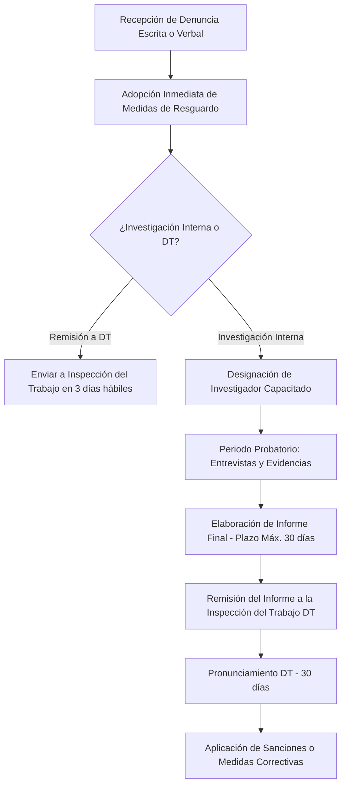

# Protocolo de Investigaciones Internas — Ley Karin (Ley 21.643 Chile)

Este skill define el procedimiento legal obligatorio para sustanciar investigaciones internas por denuncias de **acoso sexual, acoso laboral o violencia en el trabajo**, conforme a la **Ley N° 21.643 (Ley Karin)**, el Código del Trabajo y el Reglamento Interno de Orden, Higiene y Seguridad (RIOHS).

---

## 1. Marco Normativo y Tipologías de Conducta (Ley Karin)

| Conducta | Definición Legal (Ley 21.643 / Código del Trabajo) | Característica Clave en Chile |
|---|---|---|
| **Acoso Sexual** | Art. 2 inc. 2: Requerimientos de carácter sexual no consentidos por quien los recibe y que amenacen o perjudiquen su situación laboral o sus oportunidades en el empleo. | No requiere reiteración (un solo acto grave basta). |
| **Acoso Laboral** | Art. 2 inc. 2: Toda conducta que constituya agresión u hostigamiento ejercida por el empleador o por uno o más trabajadores, en contra de otro u otros trabajadores, por cualquier medio, y que tenga como resultado para él o los afectados su menoscabo, maltrato o humillación, o bien que amenace o perjudique su situación laboral o sus oportunidades en el empleo. | **Se eliminó la exigencia de que sea reiterado**. Una sola manifestación grave califica. |
| **Violencia en el Trabajo** | Art. 2 inc. 2: Conductas ejercidas por terceros ajenos a la relación laboral (clientes, proveedores, usuarios) que afecten a las personas trabajadoras en la prestación de servicios. | Obliga al empleador a adoptar medidas de protección y denuncia ante las autoridades. |

---

## 2. Flujo Procesal Obligatorio (Paso a Paso)



---

### Paso 1: Recepción de Denuncia e Intake
- **Forma de la denuncia:** Puede ser verbal o escrita. Si es verbal, la persona receptora debe levantar un acta suscrita por el/la denunciante.
- **Canal de denuncia:** Recursos Humanos, Oficial de Cumplimiento, Comité Paritario o directamente ante la Inspección del Trabajo.
- **Contenido mínimo:** Identificación de la persona denunciante, persona denunciada, relación laboral, descripción circunstanciada de los hechos, fechas, lugares y medios de prueba disponibles (mensajes, correos, testigos).

---

### Paso 2: Adopción Inmediata de Medidas de Resguardo (Obligatorio)
Tan pronto como se recibe la denuncia, el empleador **DEBE** decretar medidas cautelares o de resguardo inmediatas:
- Separación de espacios físicos de trabajo.
- Redistribución de turnos o reasignación temporal de jornada.
- Teletrabajo o trabajo a distancia para alguna de las partes (siempre con consentimiento y sin menoscabo del denunciante).
- Atención psicológica temprana a través de la Mutualidad o ACHS/ISL.

---

### Paso 3: Decisión de Sustanciación (Interna vs. DT)
Dentro de los **3 días hábiles** siguientes a la recepción de la denuncia, el empleador debe:
1. **Opción A:** Iniciar la investigación interna designando a un funcionario imparcial y capacitado en materias de género y derechos fundamentales.
2. **Opción B:** Derivar los antecedentes a la respectiva Inspección del Trabajo (DT) para que esta sustancie el procedimiento.

---

### Paso 4: Fase de Investigación y Entrevistas
- **Garantías procesales:** Principio de confidencialidad estricta, imparcialidad, celeridad, perspectiva de género y no revictimización.
- **Entrevistas obligatorias:**
  1. Ratificación y profundización de la denuncia con la persona denunciante.
  2. Notificación y traslado a la persona denunciada para que formule sus descargos y aporte pruebas.
  3. Declaración de testigos individualizados.
- **Recopilación documental:** Registros de WhatsApp, Teams, correos electrónicos corporativos, cámaras de seguridad, registros de asistencia.

---

### Paso 5: Informe Final de Investigación (Plazo Máximo: 30 Días)
La investigación debe concluir en un plazo no superior a **30 días corridos**. El informe debe contener:
1. Individualización de las partes y cronología de las diligencias.
2. Relación de hechos denunciados vs. descargos.
3. Análisis de las pruebas rendidas conforme a las reglas de la sana crítica.
4. **Conclusión y Calificación Jurídica:**
   - ¿Se acredita o desestima la existencia de Acoso Sexual, Acoso Laboral o Violencia?
5. **Propuesta de Sanciones o Medidas Correctivas:**
   - Si se desestima: medidas de recomposición del clima laboral.
   - Si se acredita falta grave: Aplicación del **Art. 160 N° 1 letra b) (acoso sexual)** o **Art. 160 N° 1 letra a) / f) (falta de probidad / acoso laboral)** del Código del Trabajo (despido disciplinario sin derecho a indemnización).
   - Faltas leves/medias: Amonestación escrita o multas del RIOHS.

---

### Paso 6: Remisión a la Inspección del Trabajo
* Concluido el informe, el empleador **debe remitirlo a la Inspección del Trabajo** dentro de los **3 días hábiles** siguientes.
* La DT tiene un plazo de **30 días** para pronunciarse o validar las conclusiones.
* Cumplido el plazo o recibidas las observaciones de la DT, el empleador dispone de **15 días hábiles** para aplicar las sanciones definitivas.

---

## Formato de Informe de Investigación (Entregable)

```markdown
# INFORME DE INVESTIGACIÓN INTERNA — LEY KARIN (LEY N° 21.643)
**Causa Interna N°:** [ROL/ID]
**Investigador/a:** [Nombre y Cargo]
**Fecha de Inicio:** [Fecha] | **Fecha de Cierre:** [Fecha]

---

### 1. Individualización de las Partes
- **Denunciante:** [Nombre, Cargo, Área, Antigüedad]
- **Denunciado/a:** [Nombre, Cargo, Área, Relación Jerárquica]

---

### 2. Medidas de Resguardo Decretadas
- [Detalle de separación física, teletrabajo o derivación a mutualidad adoptadas el día DD/MM/AAAA].

---

### 3. Síntesis de Hechos y Descargos
- **Hechos denunciados:** [Resumen objetivo de las imputaciones].
- **Descargos del denunciado/a:** [Resumen de la defensa y descargos formulados].

---

### 4. Valoración de la Prueba
- [Análisis de testimonios, correos, registros digitales y consistencia probatoria].

---

### 5. Conclusiones y Calificación Jurídica
- **Calificación:** [✅ ACREDITADO ACOSO LABORAL / ✅ ACREDITADO ACOSO SEXUAL / ❌ DESESTIMADO POR FALTA DE PRUEBA DIRECTA]
- **Normativa infringida:** [Art. 2 inc. 2 / Art. 160 N° 1 Código del Trabajo / RIOHS Art. XX].

---

### 6. Medidas y Sanciones Propuestas
- **Sanción sugerida:** [Despido disciplinario Art. 160 N° 1 / Amonestación escrita con copia a la DT].
- **Medidas organizacionales:** [Capacitaciones preventivas, reestructuración de jefaturas, monitoreo de clima].

---

### 7. Remisión a la Dirección del Trabajo
- [ ] Enviar copia íntegra del expediente a la Inspección del Trabajo competente.
```
