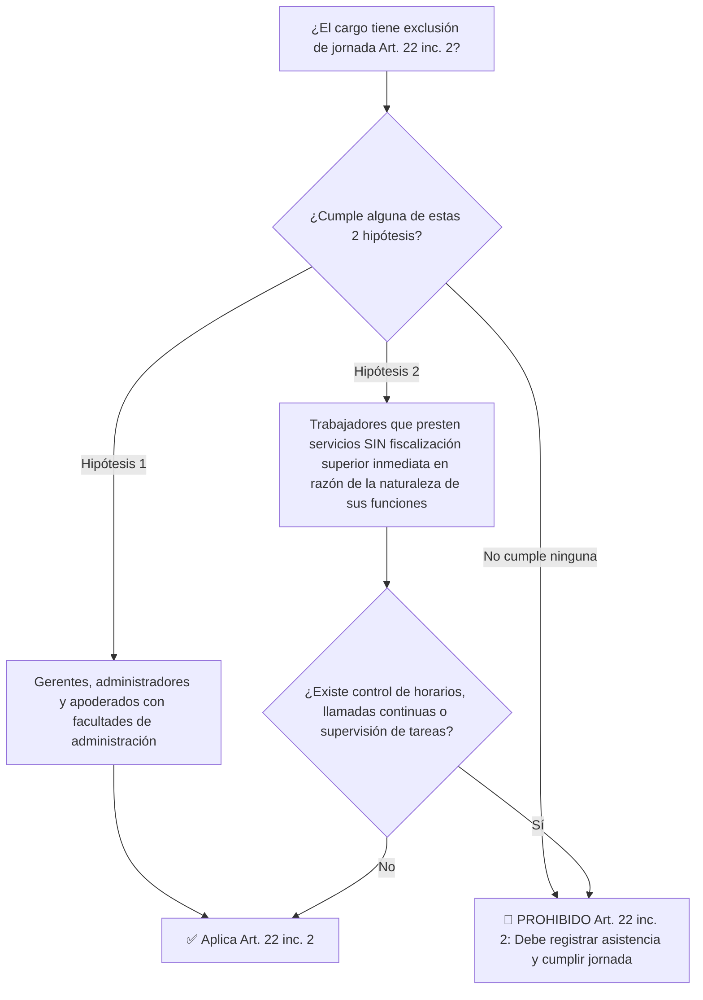

# /wage-hour-qa (Jornada de Trabajo y Horas Extra — Chile)

1. Cargar contexto laboral y marco regulatorio chileno (`employment-legal/CLAUDE.md`).
2. Analizar la consulta bajo las normas del **Código del Trabajo** y la **Ley N° 21.561 (Ley de 40 Horas)**.
3. Evaluar criterios de la **Dirección del Trabajo (DT)** y jurisprudencia judicial vigente.
4. Entregar dictamen técnico claro con citas normativas `[BCN - Código del Trabajo]` y `[Dictamen DT]`.

---

## 1. Marco de la Ley de 40 Horas (Ley N° 21.561)

### Gradualidad de la Reducción de Jornada:
* **26 de abril 2024:** 44 horas semanales.
* **26 de abril 2026:** 42 horas semanales.
* **26 de abril 2028:** 40 horas semanales.
* *Nota:* Las empresas pueden anticipar voluntariamente la reducción a 40 horas en cualquier momento.

### Distribución de la Jornada Semanal:
* La jornada puede distribuirse en **no menos de 4 días ni en más de 6 días** a la semana (permite la jornada 4x3: 4 días de trabajo y 3 de descanso, sujeta a 40 horas semanales).
* Ninguna jornada ordinaria puede exceder de **10 horas diarias**.

---

## 2. Exclusión de Jornada: El Nuevo Artículo 22 Inciso 2

Bajo la reforma de la Ley 21.561 y la doctrina estricta de la DT (Dictamen N° 84/04 y N° 235/08):



> ⚠️ **Criterio DT:** Si el trabajador debe reportarse a horas fijas, marcar ingreso/salida (físico o digital), o tiene supervisión directa constante de sus tareas por una jefatura, **NO procede el Art. 22 inc. 2**. Deberá pactarse jornada y llevar sistema de registro de asistencia autorizado por la DT.

### Resolución de Controversias sobre Art. 22:
Si el empleador o el trabajador discrepan sobre la procedencia de la exclusión, cualquiera de las partes puede acudir a la **Inspección del Trabajo**. La resolución administrativa de la DT es reclamable ante el **Juez de Letras del Trabajo** dentro del plazo fatal de **5 días hábiles**.

---

## 3. Horas Extraordinarias y Sobretasa

1. **Requisitos de Procedencia (Art. 30 y 32):**
   * Solo proceden para atender necesidades o situaciones temporales de la empresa.
   * Deben constar en un **pacto escrito previo**, con una vigencia máxima de **3 meses**, renovable.
   * Límite legal: Máximo **2 horas extraordinarias por día**.
2. **Cálculo de la Sobretasa:**
   * Se pagan con un recargo mínimo del **50% sobre el sueldo convenido para la jornada ordinaria**.
   * Deben liquidarse y pagarse conjuntamente con las remuneraciones del período respectivo.
3. **Compensación en Días de Descanso (Novedad Ley 40 Horas - Art. 32 inc. final):**
   * Las partes pueden acordar por escrito que las horas extraordinarias se compensen por hasta **5 días hábiles de feriado adicional al año**, los cuales deben utilizarse dentro de los 6 meses siguientes.

---

## 4. Descansos: Colación y Descanso Semanal

* **Descanso dentro de la jornada (Colación - Art. 34):**
  * Mínimo **30 minutos**.
  * No se considera trabajado ni se imputa a la jornada laboral, salvo acuerdo contractual más favorable.
* **Descanso Semanal (Art. 35 y 38):**
  * Regla general: Domingos y festivos son días de descanso obligatorio.
  * Excepciones (Art. 38): Comercio, faenas continuas, turismo, etc. Requieren otorgar 1 día de descanso compensatorio por cada domingo o festivo trabajado, y al menos **2 domingos de descanso al mes** en el comercio.

---

## Formato de Dictamen de Respuesta

```markdown
# DICTAMEN DE CONSULTA LABORAL — JORNADA Y REMUNERACIONES
**Materia:** [Jornada 40H / Art. 22 inc. 2 / Horas Extra / Registro de Asistencia]
**Fecha:** [Fecha]

---

### 1. Respuesta Ejecutiva (Bottom Line)
[Respuesta directa y concreta a la consulta planteada en 2-3 líneas].

---

### 2. Fundamentación Jurídica y Normativa
- **Norma Legal Aplicable:** `[BCN - Código del Trabajo, Art. XX]` / `[BCN - Ley N° 21.561]`.
- **Criterio de la Dirección del Trabajo:** `[Dictamen DT N° XXXX/XX de Fecha DD/MM/AAAA]`.
- **Análisis del caso:** [Explicación detallada de la subsunción de los hechos en la norma].

---

### 3. Matriz de Riesgo y Contingencias
- **Riesgo de Multa Administrativa DT:** [Bajo / Medio / Alto — Tipificada como gravísima si es infracción de jornada o registro].
- **Riesgo de Cobro Judicial:** [Posibilidad de demanda de cobro de horas extraordinarias de los últimos 2 años más reajustes e intereses del Art. 63].

---

### 4. Recomendación Práctica y Cláusulas Sugeridas
[Redacción de cláusula contractual ajustada a la ley o medidas de gestión interna recomendadas].
```
