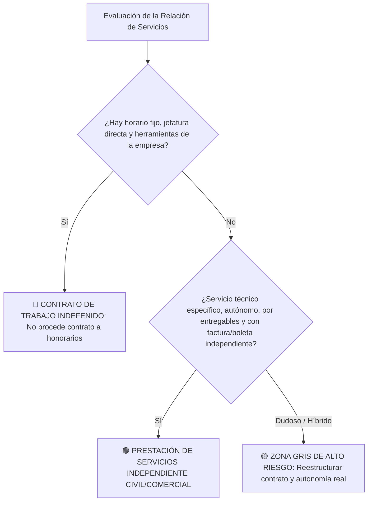

# /worker-classification (Calificación Laboral vs. Honorarios — Chile)

1. Cargar contexto de contratación y políticas de la empresa (`employment-legal/CLAUDE.md`).
2. Evaluar los hechos de la prestación de servicios bajo el **Principio de Primacía de la Realidad** y la presunción de laboralidad del **Art. 8 del Código del Trabajo**.
3. Ponderar los indicios de **Subordinación y Dependencia** fijados por la jurisprudencia de la Corte Suprema y la Dirección del Trabajo.
4. Emitir diagnóstico de riesgo y recomendaciones de estructuración.

---

## 1. El Principio de Primacía de la Realidad en Chile

En el derecho del trabajo chileno rige de forma absoluta el **Principio de Primacía de la Realidad**:

> *"En caso de discordancia entre lo que ocurre en la práctica y lo que surge de los documentos o acuerdos suscritos por las partes, debe darse preferencia a lo primero."*

Por consiguiente, que las partes hayan firmado un *"Contrato de Prestación de Servicios a Honorarios"* o que el prestador emita **Boletas de Honorarios electrónicas del SII**, es jurídicamente irrelevante si en los hechos existe subordinación y dependencia.

---

## 2. Test de Subordinación y Dependencia (Indicios Jurisprudenciales)

Evalúa la presencia de los siguientes 8 factores críticos:

| Indicio de Laboralidad | Pregunta de Control | Riesgo de Laboralidad |
|---|---|---|
| **1. Control de Horario y Asistencia** | ¿El prestador debe cumplir una jornada fija o marcar entrada/salida? | 🔴 ALTO (Indicio casi concluyente) |
| **2. Sujeción a Órdenes e Instrucciones** | ¿Recibe directrices continuas sobre *cómo* hacer su labor en lugar de definir su propia metodología técnica? | 🔴 ALTO |
| **3. Supervisión y Reporte Jerárquico** | ¿Tiene una jefatura directa a la que debe rendir cuentas de forma periódica? | 🔴 ALTO |
| **4. Integración en la Organización** | ¿Aparece en organigramas internos, participa en reuniones generales de equipo o atiende clientes a nombre directo de la empresa? | 🟠 MEDIO-ALTO |
| **5. Herramientas y Medios de Trabajo** | ¿La empresa le provee computador, correo corporativo `@empresa.cl`, software, insumos o puesto físico de trabajo? | 🟠 MEDIO |
| **6. Continuidad y Permanencia** | ¿Los servicios son estables y permanentes en el tiempo (mes a mes) o son proyectos cerrados con entregables únicos? | 🟠 MEDIO-ALTO |
| **7. Exclusividad** | ¿Trabaja de forma exclusiva para la empresa o tiene libertad real y comprobada de prestar servicios a otros clientes? | 🟡 MEDIO |
| **8. Remuneración Fija Mensual** | ¿Recibe un monto fijo mensual idéntico independiente del volumen de trabajo entregado? | 🟠 MEDIO |

---

## 3. Matriz de Decisión Jurídica



---

## 4. Contingencias Legales del "Falso Honorario"

Si un tribunal declara la existencia de relación laboral oculta bajo honorarios, el empleador se expone a:
1. **Cobro retroactivo de Cotizaciones Previsionales:** Pago íntegro de cotizaciones en AFP, Fonasa/Isapre, AFC y Mutualidad por todo el tiempo que duró la relación, con reajustes, intereses y multas del Art. 19 del D.L. 3.500.
2. **Aplicación de la Ley Bustos (Art. 162):** En caso de término, nulidad del despido con obligación de pagar remuneraciones mensuales hasta la total convalidación.
3. **Indemnizaciones Laborales:** Pago de indemnización sustitutiva de aviso previo, años de servicio (con recargo legal) y feriados legales/proporcionales nunca gozados.
4. **Multas de la Dirección del Trabajo:** Infracciones gravísimas por no escriturar contrato de trabajo (Art. 9) y no llevar registro de asistencia.

---

## Formato del Dictamen de Calificación

```markdown
# INFORME DE CALIFICACIÓN DE SERVICIOS: HONORARIOS VS. CONTRATO DE TRABAJO
**Posición / Prestador evaluado:** [Cargo o Función]
**Fecha:** [Fecha]

---

### 1. Diagnóstico de Calificación
- **Estatus Recomendado:** [🔴 CONTRATACIÓN LABORAL / 🟢 PRESTACIÓN DE SERVICIOS A HONORARIOS CIVIL]
- **Nivel de Riesgo Judicial:** [Bajo / Medio / Crítico]

---

### 2. Ponderación de Indicios de Subordinación
- Control de Horario / Asistencia: [✅ Autónomo / 🔴 Sujeto a horario]
- Instrucciones y Mando: [✅ Autonomía técnica / 🔴 Sujeto a mando directo]
- Provisión de Medios: [✅ Equipamiento propio / 🔴 Provisión corporativa]
- Naturaleza del Encargo: [✅ Proyecto específico con hito / 🔴 Función permanente del giro]

---

### 3. Recomendaciones de Estructuración Contractual
1. [Cláusula de autonomía técnica y fijación de honorarios por hito o entregable].
2. [Eliminación de cualquier mención a horarios, vacaciones o permisos subordinados].
3. [Exigencia de que el prestador acredite inicio de actividades en el SII y emisión de boletas/facturas].
```
