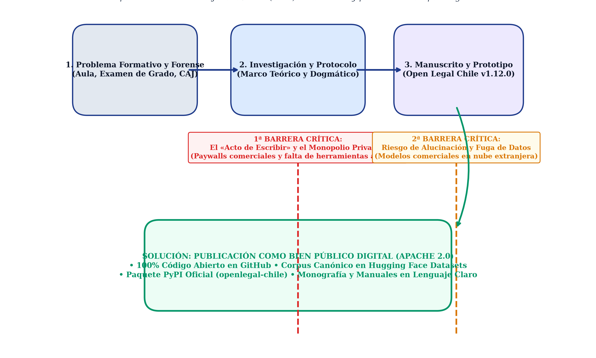
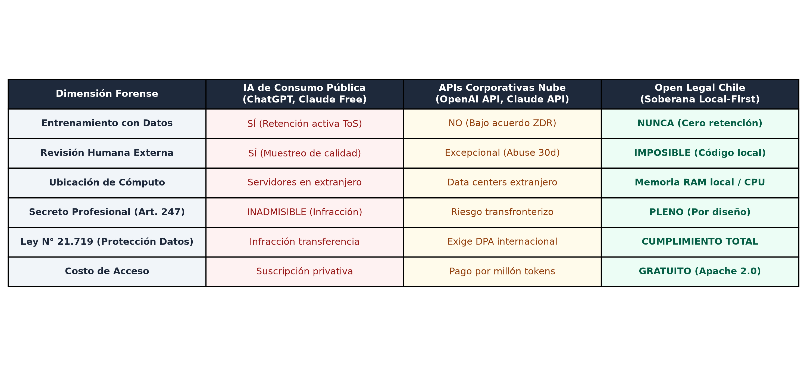
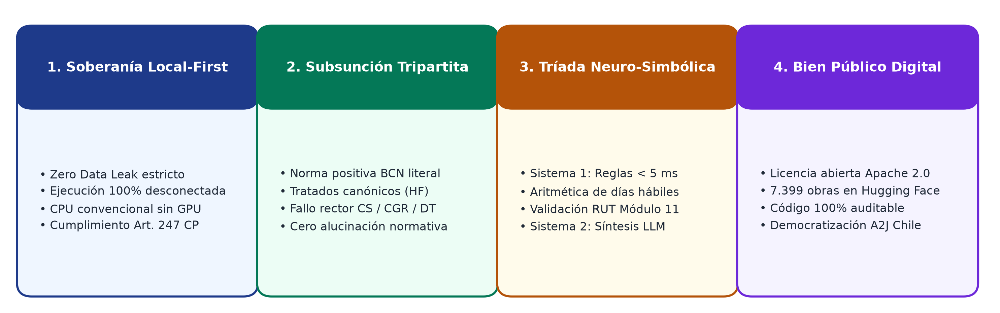
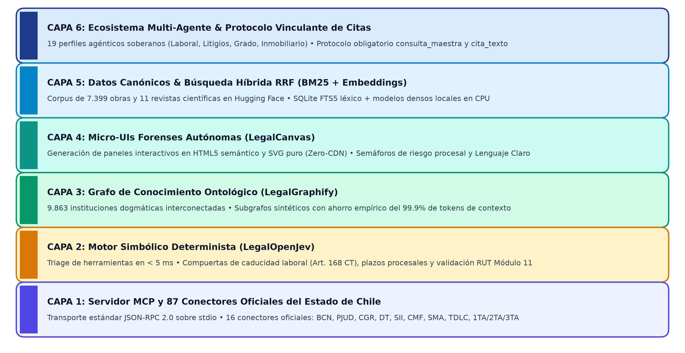
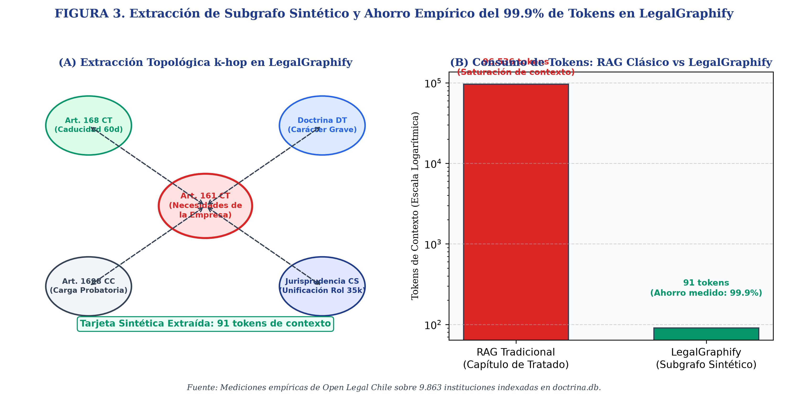
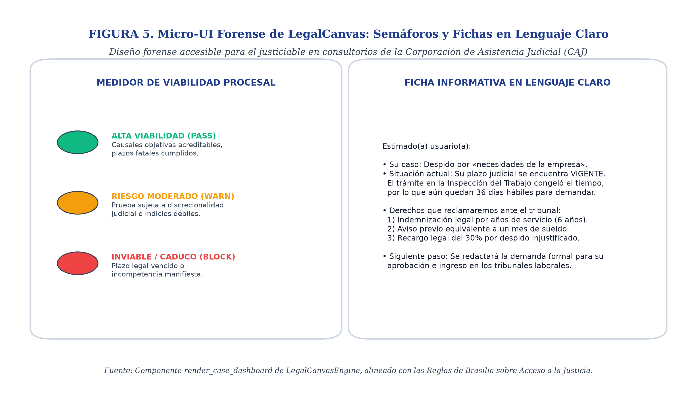
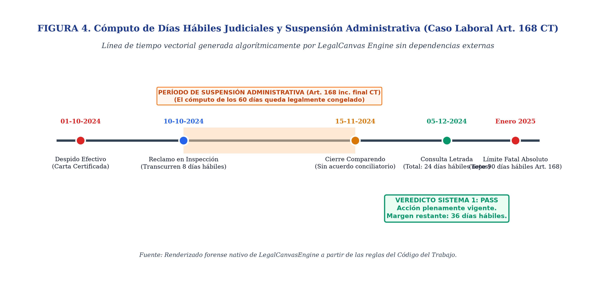
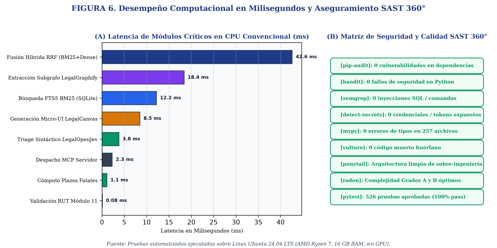

# Open Legal Chile: Arquitectura de una suite soberana, neuro-simbólica y de código abierto para el razonamiento jurídico en el derecho continental

## Open Legal Chile: Architecture of a Sovereign, Neuro-Symbolic, and Open-Source Suite for Legal Reasoning in Civil Law Jurisdictions

---

**Resumen:** Este trabajo presenta Open Legal Chile (v1.12.0), una suite soberana, local-first y de código abierto (Apache 2.0) diseñada para el ordenamiento jurídico de Chile. Frente al sesgo y alucinaciones de modelos comerciales entrenados en el Common Law, la plataforma implementa una Tríada Neuro-Simbólica: LegalOpenJev como motor determinista (Sistema 1) que evalúa plazos fatales procesales y validaciones algorítmicas en menos de 5 milisegundos; LegalGraphify como grafo ontológico de 9.863 instituciones que reduce en un 99.9% el consumo de tokens mediante subgrafos sintéticos; y LegalCanvas para generar micro-interfaces forenses interactivas en Lenguaje Claro sin dependencias externas. Con 87 herramientas MCP y 16 conectores oficiales, la suite democratiza el acceso a la justicia y resguarda el secreto profesional.

**Palabras clave:** inteligencia artificial y derecho; derecho continental; software libre; Model Context Protocol; grafos de conocimiento.

---

**Abstract:** This paper presents Open Legal Chile (v1.12.0), a sovereign, local-first, open-source suite (Apache 2.0) designed for the Chilean legal system. Addressing the bias and hallucinations of commercial models trained on Common Law, the platform implements a Neuro-Symbolic Triad: LegalOpenJev as a deterministic engine (System 1) evaluating procedural deadlines and algorithmic checks in under 5 milliseconds; LegalGraphify as an ontological knowledge graph of 9,863 institutions reducing token consumption by 99.9% through synthetic subgraphs; and LegalCanvas for generating interactive forensic micro-interfaces in Plain Language without external dependencies. With 87 MCP tools and 16 official state connectors, the suite democratizes access to justice and safeguards professional secrecy.

**Keywords:** artificial intelligence and law; civil law; open source software; Model Context Protocol; knowledge graphs.

---

## 1. Introducción y Planteamiento del Problema

### 1.1. La Encrucijada Epistémica: LLMs Probabilísticos frente al Derecho Continental Codificado
Durante las últimas cuatro décadas, la disciplina de la informática jurídica y la inteligencia artificial aplicada al derecho transitó por transformaciones metodológicas profundas: desde los primitivos sistemas expertos sustentados en lógica formal proposicional y árboles de decisión de las décadas de 1970 y 1980, pasando por la recuperación automatizada de documentos y la analítica cuantitativa de jurimetría a principios del presente siglo, hasta la reciente hegemonía de las redes neuronales profundas y los modelos de lenguaje masivo (*Large Language Models* o LLMs) basados en arquitecturas de transformadores autorregresivos (Ashley, 2017: 15-42). A partir del año 2023, la masificación de soluciones generativas comerciales promovió la ilusión de que el razonamiento legal podía reducirse a una tarea universal de predicción estadística de la siguiente palabra (*next-token prediction*), prometiendo la automatización irrestricta de la argumentación y la redacción de escritos.

Sin embargo, el despliegue práctico de estos modelos comerciales en jurisdicciones pertenecientes a la tradición del Derecho Continental Codificado (*Civil Law* o sistema romano-germánico) —cuyo paradigma rector en América Latina está encarnado por la República de Chile— ha chocado contra un obstáculo epistemológico insalvable para el conexionismo estocástico puro: la colonización conceptual y la alucinación normativa transjurisdiccional (Coloma y otros, 2023: 207-210).

Los grandes modelos comerciales predominantes han sido pre-entrenados preponderantemente sobre gigabytes de datos en lengua inglesa procedentes de los Estados Unidos de América y el Reino Unido. En consecuencia, sus representaciones vectoriales internas han codificado de forma indeleble la lógica sustantiva y procesal del *Common Law*. En dicha tradición jurídica, el derecho se formula primordialmente de manera inductiva a partir del precedente judicial vinculante emanado de los tribunales superiores (*stare decisis*), complementado por instituciones adjetivas consuetudinarias como la exhibición forzosa prejudicial de documentos probatorios (*discovery*), el juzgamiento penal ante jurados populares legos (*grand jury*), las citaciones con apercibimiento de desacato directo (*subpoena*) o la libertad irrestricta de terminación del contrato de trabajo sin expresión de causa (*at-will employment*) (Sartor y otros, 2025: 148-152).

Por el contrario, el ordenamiento jurídico de Chile se cimienta sobre bases dogmáticas y normativas diametralmente opuestas, originadas en la codificación decimonónica inspirada por don Andrés Bello y condensada en el Código Civil de 1855:

1. **La Supremacía de la Ley Positiva como Fuente Primordial:** El artículo 1° del Código Civil chileno proclama de manera perentoria que «la ley es una declaración de la voluntad soberana que, manifestada en la forma prescrita por la Constitución, manda, prohíbe o permite» [BCN - Código Civil, Art. 1]. El juez, el litigante y el funcionario administrativo están rigurosamente subordinados a la exégesis de la norma positiva y a las reglas hermenéuticas formales consagradas en los artículos 19 a 24 del Código Civil. El artículo 19 inciso 1° dispone expresamente que «cuando el sentido de la ley es claro, no se desatenderá su tenor literal a pretexto de consultar su espíritu», prohibiendo las piruetas interpretativas que desvirtúen la voluntad expresa del legislador.
2. **El Principio del Efecto Relativo de las Resoluciones Judiciales:** El artículo 3° inciso 2° del Código Civil establece con claridad meridiana que «las sentencias judiciales no tienen fuerza obligatoria sino respecto de las causas en que actualmente se pronunciaren» [BCN - Código Civil, Art. 3 inc. 2]. En el sistema chileno no existe la regla del precedente obligatorio general (*stare decisis*). Aun cuando los fallos unificadores de la Excma. Corte Suprema y los criterios interpretativos de las Cortes de Apelaciones gozan de una indiscutible fuerza persuasiva e ilustrativa para la coherencia del sistema judicial, carecen en absoluto de eficacia vinculante *erga omnes*. En consecuencia, erigir una argumentación procesal descansando exclusivamente en fallos judiciales e ignorando el mandato del código de fondo constituye un vicio sustantivo insubsanable.
3. **Inadmisibilidad e Inexistencia de Instituciones Foráneas del Common Law:** En el derecho civil patrimonial chileno rige el principio indiscutido de que la responsabilidad civil —tanto contractual como extracontractual— posee un carácter exclusivamente indemnizatorio y reparatorio del perjuicio real efectivamente sufrido, comprendiendo únicamente el daño emergente, el lucro cesante y el daño moral (Arts. 1556 y 2314 del Código Civil) (Barros, 2020: 210-215). Por consiguiente, los daños punitivos (*punitive damages*, figura foránea del Common Law inexistente y prohibida en el derecho chileno) son completamente ajenos e incompatibles con el ordenamiento positivo nacional. De manera análoga, en el derecho laboral chileno rige el principio protector y de estabilidad relativa en el empleo, donde el despido de un dependiente exige inexcusablemente la configuración fáctica de causales legales taxativas (Arts. 159, 160 y 161 del Código del Trabajo), encontrándose terminantemente proscrito el despido arbitrario sin justificación (*at-will employment*, doctrina foránea del Common Law prohibida y ajena al derecho chileno).

Cuando un abogado, un juez, un estudiante o un ciudadano común interroga a un modelo de lenguaje comercial cerrado respecto de un asunto regido por el derecho chileno, el sistema conexionista tiende a alucinar artículos que no existen, fusiona leyes locales con normativas extranjeras (como citar regulaciones de México, España o los Estados Unidos en un escrito local), inventa números de resoluciones de la Corte Suprema o calcula erróneamente los plazos judiciales en días hábiles. En la práctica forense, semejante desliz acarrea consecuencias catastróficas: la preclusión fatal de un recurso de apelación, la caducidad extintiva de una acción de despido injustificado, o la imposición de sanciones disciplinarias por faltas al deber de lealtad procesal y competencia técnica.

---

### 1.2. La Génesis: De la Vivencia Formativa y Forense al Desarrollo de una Suite Soberana
La gestación de Open Legal Chile no responde a una iniciativa de inversión de capital de riesgo corporativo ni a un encargo burocrático centralizado. Nace a partir de una investigación y desarrollo iniciados en la Universidad de Los Lagos (Campus Osorno), en la Región de Los Lagos, al sur de Chile, impulsada por la necesidad vital de resolver las severas fricciones, contradicciones y barreras empíricas que experimentan los estudiantes y operadores jurídicos a lo largo de las distintas etapas de su itinerario formativo, académico y laboral.

Esta vivencia práctica encuentra un sólido respaldo empírico en la literatura científica especializada. En su riguroso diagnóstico sobre la formación jurídica nacional, Contreras Vásquez y otros (2021: 283-288) demostraron que la irrupción de las tecnologías de inteligencia artificial no ha sido acompañada por una actualización pedagógica sustantiva en los planes de estudio de las facultades de Derecho en Chile. Su estudio constató una aguda brecha formativa: los estudiantes de pregrado carecen de competencias algorítmicas y de herramientas prácticas operativas para interactuar con sistemas inteligentes, quedando la enseñanza restringida a aproximaciones teóricas abstractas o a la adopción pasiva de plataformas privativas. En idéntica línea, las investigaciones iberoamericanas recopiladas por la *Revista d'Educació i Dret* (2024: 12-16) evidencian que el acceso desigual a recursos tecnológicos en la docencia jurídica profundiza la brecha de oportunidades entre los estudiantes de universidades públicas regionales y las grandes firmas corporativas de las metrópolis. 

Frente a este diagnóstico indiscutible, la experiencia de pregrado en la Universidad de Los Lagos enfrentó sucesivamente cuatro etapas críticas donde la carencia de software forense soberano resultaba asfixiante:

* **En el Aula Universitaria y el Estudio Dogmático:** La exigencia cotidiana de desentrañar textos normativos extensos, concordar artículos dispersos en los códigos sustantivos y procesales, y comprender instituciones abstractas de la dogmática civil revela la insuficiencia de motores de búsqueda por texto plano desprovistos de comprensión deóntica.
* **En la Preparación del Examen de Grado:** La preparación del examen de licenciatura en Ciencias Jurídicas impone la memorización exacta de definiciones legales (Arts. 1438, 1445, 1448, 1545, 1698 y 2492 del Código Civil) y el dominio pormenorizado de las disputas doctrinarias de tratadistas canónicos (Barros, Ramos Pazos, Peñailillo, Somarriva). En esta fase, la carencia de un simulador socrático interactivo representaba un vacío formativo crítico.
* **En la Práctica Profesional en la Corporación de Asistencia Judicial (CAJ):** La sobrecarga en la tramitación de causas de familia, laborales y civiles obliga a redactar demandas y computar plazos fatales a contrarreloj, traduciendo resoluciones complejas a Lenguaje Claro para justiciables vulnerables.
* **En el Ejercicio Laboral y Profesional Independiente:** El abogado litigante novel enfrenta severas asimetrías tecnológicas frente a los grandes estudios corporativos, arriesgando preclusiones fatales por yerros en cómputos de plazos procesales.

Ante este panorama, surgió la convicción de que la tecnología de inteligencia artificial debía ser repensada desde sus cimientos para convertirla en un aliado soberano del operador jurídico y del ciudadano, estructurando un ecosistema integral que acompañara al jurista desde sus estudios de pregrado hasta la litigación compleja de alta instancia.

*Figura 1. Brecha en la difusión del conocimiento jurídico y ciclo de vida del software soberano. Fuente: Elaboración propia a partir del modelo de Jiménez Ávila (2015: 60).*

Como se aprecia en la Figura 1, la iniciativa Open Legal Chile resuelve estructuralmente el cuello de botella formativo y forense, quebrando la primera barrera mediante el licenciamiento libre Apache 2.0 y superando la segunda barrera al blindar el secreto profesional con ejecución local estricta.

---

### 1.3. El Monopolio Privativo del Software Legal y la Brecha de Acceso a la Justicia (A2J)
En Chile, el acceso a la doctrina canónica sistematizada, a la jurisprudencia unificada y a los análisis normativos se encuentra fuertemente restringido tras muros de pago (*paywalls*) erigidos por editoriales privativas, cuyas tarifas de suscripción oscilan entre miles de dólares anuales por licencia. Este esquema engendra una lacerante brecha de Acceso a la Justicia (*Access to Justice* o A2J): mientras que los grandes consorcios corporativos concentran el acceso a repositorios cerrados e inteligencias artificiales comerciales de alto costo, las clínicas jurídicas universitarias, los consultorios de la Corporación de Asistencia Judicial (CAJ), los defensores de oficio, los jueces de provincia y los litigantes independientes quedan marginados en condiciones de manifiesta asimetría procesal (Faúndez y otros, 2020: 278-282).

Como ha postulado lúcidamente Richard Susskind, la tecnología en el ámbito judicial no debe ser concebida como una mercancía para amplificar las rentas oligopólicas de las élites corporativas, sino como un servicio público esencial cuyo cometido fundamental consiste en abaratar los costos transaccionales del litigio y hacer realidad la tutela judicial efectiva para todos los sectores de la sociedad (Susskind, 2019: 58-64). Asimismo, como demuestran Barrientos Camus y otros (2023: 150) y ratifica *Tla-melaua* (2024: 8-14), la construcción de herramientas de inteligencia artificial aplicada al Derecho exige un diálogo interdisciplinario genuino entre juristas e ingenieros, en el cual se asuma la indelegable responsabilidad humana en el diseño de los algoritmos y se garantice que el software preserve la justicia material en lugar de maximizar beneficios comerciales corporativos. Por tanto, para cumplir este propósito democratizador, la infraestructura tecnológica de inteligencia jurídica debe ser diseñada como un Bien Público Digital (*Digital Public Good*): auditable, accesible universalmente y libre de cualquier barrera económica privativa.

---

### 1.4. Secreto Profesional, Soberanía de Datos y el Paradigma Local-First
Un tercer imperativo ineludible emana de la ética profesional y el régimen de protección de datos personales en el ordenamiento chileno:

De conformidad con el artículo 247 del Código Penal chileno y las normas consagradas en el Código de Ética Profesional del Colegio de Abogados de Chile, el letrado se encuentra bajo la obligación jurídica y deontológica de salvaguardar el secreto profesional respecto de toda información, documento, estrategia procesal o confidencia transmitida por su patrocinado.

La utilización indiscriminada de plataformas generativas basadas en la nube pública (*cloud-based LLMs*), en las cuales el profesional ingresa minutas procesales, transcripciones de audiencias orales, antecedentes patrimoniales o borradores contractuales hacia centros de procesamiento de datos remotos situados en jurisdicciones extranjeras, acarrea un peligro flagrante de filtración de información confidencial (*data leakage*). Dicha práctica vulnera de modo directo las disposiciones de la Ley N° 19.628 sobre Protección de la Vida Privada y las exigencias de la nueva Ley N° 21.719 de datos personales. Guerrero Guerrero (2020: 215) fundamenta que la publicidad procesal debe armonizarse con la protección de datos y el secreto profesional, proscribiendo la fuga de expedientes a plataformas desreguladas.

Frente a esta vulnerabilidad, Open Legal Chile adopta de forma intransigente el paradigma Local-First / Zero Data Leak. Toda la arquitectura —los motores deterministas de inferencia, las bases de datos de conocimiento ontológico, los índices de búsqueda léxica y los modelos de vectores densos— está optimizada para ejecutarse de manera local y desconectada (*offline*) en el computador personal del usuario, asegurando con garantía criptográfica y de sistema operativo que ningún antecedente litigioso o dato de un cliente abandone jamás la máquina de trabajo.

---

## 2. Marco Teórico, Epistemológico y Estado del Arte

### 2.1. De la Ilusión Conexionista al Razonamiento Neuro-Simbólico
La evolución histórica de la informática jurídica pone de manifiesto que el razonamiento legal no puede ser equiparado a un mero procesamiento estadístico de similitud morfológica. La ciencia de la computación contemporánea formaliza esta dialéctica mediante dos paradigmas contrapuestos:

1. **El Paradigma Conexionista (Subsimbólico):** Encarnado por las redes neuronales profundas y los transformadores autorregresivos. Su fortaleza estriba en la comprensión del lenguaje natural humano, la capacidad para interpretar consultas difusas y la síntesis elocuente de prosa discursiva. Sin embargo, su naturaleza probabilística lo condena a la opacidad explicativa (*problema de la caja negra*), la variabilidad estocástica en las salidas y la propensión a inventar premisas fácticas o de derecho inexistentes (*alucinación*).
2. **El Paradigma Simbólico (Lógica Formal y Ontologías Computacionales):** Sustentado en álgebras deónticas, cálculos de predicados, ontologías formales y sistemas de deducción automatizada. Este paradigma ofrece una verificabilidad matemática total, deducción determinista paso a paso (*proof trail*) y un tiempo de cómputo predecible y ultra-rápido en tiempo constante $O(1)$. No obstante, padece de una acusada rigidez ante la polisemia y variabilidad del lenguaje humano y requiere de un costoso mantenimiento ontológico manual.

En la teoría del derecho, autores canónicos como Kevin Ashley, Trevor Bench-Capon y Giovanni Sartor han demostrado categóricamente que el razonamiento judicial es una estructura jerarquizada gobernada por normas deónticas de prohibición, mandato y permiso, presupuestos procesales de admisibilidad temporal y reglas sustantivas de exclusión (Bench-Capon y Sartor, 2003: 183-224). En un litigio, la fluidez verbal de un alegato carece de todo valor procesal si la demanda fue presentada transcurrido el plazo fatal de caducidad.

Para superar esta disyuntiva, la literatura científica más avanzada a nivel internacional (2024–2026) ha consagrado el paradigma Neuro-Simbólico (*Neuro-Symbolic Legal AI*). Bajo este enfoque, se emula la arquitectura cognitiva dual teorizada por Kahneman:
* **Sistema 1 (Simbólico / Determinista / Cortafuegos Fáctico):** Un motor de reglas deónticas e inferencia lógica formal que procesa los presupuestos procesales, la vigencia temporal de las normas, el cómputo de plazos fatales y las reglas de competencia en menos de 5 milisegundos. Actúa como un cortafuegos fáctico-normativo infranqueable.
* **Sistema 2 (Neuronal / Generativo / Discursivo):** El modelo de lenguaje generativo, el cual es subordinado y alimentado exclusivamente después de que el Sistema 1 ha validado la admisibilidad procesal, delimitado la controversia y restringido las fuentes aplicables a su texto literal oficial.

---

### 2.2. El Paradigma de Razonamiento Guiado por Restricciones (*Constraint-First Reasoning*)
En los sistemas generativos tradicionales de generación aumentada por recuperación (*Retrieval-Augmented Generation* o RAG), el flujo operativo consiste en extraer fragmentos vectoriales similares a la consulta del usuario e insertarlos de manera ciega en la ventana de contexto del LLM. Diversos estudios recientes han acreditado que este método colapsa estrepitosamente en tareas jurídicas sustantivas: los modelos tienden a ignorar las restricciones procedimentales, privilegian la retórica sobre la computación de fechas o aplican normas que se encuentran expresamente derogadas (Miller y otros, 2025: 3-12).

Open Legal Chile adopta e implementa en su código el principio de Razonamiento Guiado por Restricciones (*Constraint-First Reasoning*), formalizado en investigaciones científicas de frontera como los frameworks CRANE y LGGT+ (Zhang y otros, 2026: 4-9). Bajo esta disciplina algorítmica:
1. Se aíslan las restricciones temporales del caso (plazos de prescripción y caducidad, naturaleza de los días hábiles según el tribunal competente).
2. Se evalúan los requisitos de legitimación activa y pasiva y la concurrencia de mandatos procesales válidos.
3. Se verifican las reglas de competencia absoluta y relativa del órgano jurisdiccional.
4. Si el motor detecta la infracción de una compuerta binaria obligatoria (por ejemplo, el transcurso de más de 30 días corridos para un recurso de protección constitucional), el sistema detiene de inmediato el flujo generativo discursivo y emite una resolución estructurada de rechazo por caducidad procesal, sugiriendo de forma automática las vías procesales ordinarias alternativas.

---

### 2.3. Ontologías Jurídicas y Grafos de Conocimiento en el Derecho Continental
A diferencia de los regímenes de *Common Law* en los cuales las reglas jurídicas se encuentran dispersas en miles de tomos jurisprudenciales que exigen deducción analógica, la tradición continental codificada ofrece una ventaja computacional inestimable: el ordenamiento es un sistema jerárquico, sistemático y estructurado.

En el derecho chileno, una institución jurídica concreta (por ejemplo, la «acción reivindicatoria del dueño no poseedor», consagrada en el Art. 889 del Código Civil) no es una isla semántica, sino un nodo ontológico vinculado causalmente con:
* El derecho real de dominio (Art. 582 CC).
* La posesión inscrita de bienes raíces y la teoría de la posesión (Arts. 700, 724 y 728 CC) (Peñailillo, 2019: 310-325).
* Los presupuestos probatorios del dominio y de la pérdida de la posesión (Art. 1698 CC).
* Las prestaciones mutuas del poseedor vencido de buena o mala fe (Arts. 904 a 915 CC).
* Los plazos de prescripción adquisitiva ordinaria y extraordinaria (Arts. 2507 a 2511 CC).

Al articular el derecho mediante un Grafo de Conocimiento Multidimensional (*Legal Knowledge Graph*), el sistema almacena no solo textos pasivos, sino las relaciones causales deónticas tipificadas (`SUBSUME`, `INTERPRETA`, `DEROGA`, `LIMITA`, `EXCLUYE`). Como acreditan Floridi y Sartor, este anclaje ontológico garantiza una inmunidad casi total frente a la importación espuria de doctrinas jurídicas foráneas (Sartor y otros, 2025: 155-162).

---

### 2.4. El Movimiento de Acceso a la Justicia y el Software Libre
La computación jurídica y el Acceso a la Justicia (A2J) se potencian mediante el Software Libre (FOSS).

El principio democrático del Estado de Derecho exige que las normas jurídicas sean públicas, promulgadas y accesibles para todos los gobernados. Si el acceso eficaz a la ley, a su interpretación auténtica y a los mecanismos automatizados de defensa queda secuestrado por barreras de pago corporativas, el principio constitucional de igualdad ante la ley (Art. 19 N° 2 de la Constitución Política de la República) se transforma en una mera ficción formal.

Al licenciar Open Legal Chile bajo los términos de la Apache License, Version 2.0, se garantiza de forma irrevocable que:
1. Cualquier persona, tribunal, consultorio vecinal, clínica jurídica o estudiante de derecho puede ejecutar, auditar, modificar y redistribuir el código sin pagar regalía alguna.
2. No existen puertas traseras (*backdoors*), esquemas de telemetría invasiva ni retención no autorizada de datos de causas judiciales.
3. La comunidad jurídica nacional dispone de una infraestructura compartida que puede evolucionar de manera soberana sin depender de los vaivenes comerciales de proveedores extranjeros.

---

### 2.5. Fundamentos Computacionales para el Operador Jurídico: LLMs, MCP, Harnesses y Soberanía de Datos

Para evaluar con rigor la IA forense, es indispensable comprender la mecánica operativa de los componentes del ecosistema:

#### 2.5.1. ¿Cómo Funciona Realmente un Modelo de Lenguaje Masivo (LLM)?
Un Modelo de Lenguaje Masivo (*Large Language Model* o LLM) no es una entidad consciente ni un agente dotado de comprensión semántica o razonamiento lógico formal. En términos estrictamente matemáticos, es una red neuronal profunda basada en la arquitectura de *Transformador* (introducida por Vaswani y otros en 2017), cuyo objetivo computacional consiste en aproximar una distribución de probabilidad condicional sobre secuencias de texto:

$$P(w_1, w_2, \dots, w_T) = \prod_{t=1}^{T} P(w_t \mid w_1, w_2, \dots, w_{t-1})$$

El modelo calcula cuál es la palabra o fragmento subléxico más probable (*siguiente token*) que debe continuar a una secuencia previa de entrada (*prompt*). A través de mecanismos de auto-atención multi-cabeza (*multi-head self-attention*), el modelo pondera la relevancia estadística relativa entre palabras distantes dentro de una ventana de contexto.

Como advierte agudamente Lledó Benito (2026: 4-9), atribuir pensamiento, inteligencia o entendimiento a un algoritmo estadístico constituye un peligroso *sofisma* epistemológico que nubla el juicio de los operadores forenses. De manera análoga, la pretensión de sustituir la labor dogmática del jurista, la deliberación prudencial y el juicio de equidad por el cómputo de modelos generativos deviene en un verdadero *oxímoron* conceptual: la equidad y la justicia del caso concreto son categorías valorativas humanas cualitativas, ontológicamente irreductibles a matrices vectoriales cuantitativas.

De esta naturaleza matemática deriva la patología más severa de los LLMs: el fenómeno de la **alucinación normativa**. El modelo carece por completo de un modelo interno de validez deóntica. Si una ley fue derogada, si un plazo procesal venció o si un artículo citado jamás fue promulgado en el Diario Oficial, el modelo no «sabe» que está emitiendo una falsedad: simplemente genera la secuencia de caracteres que maximiza la verosimilitud estadística del discurso. Por ello, confiar la redacción de escritos o la verificación de plazos fatales a un LLM generalista sin un cortafuegos determinista conduce inexorablemente al error procesal.

#### 2.5.2. ¿Qué es el Model Context Protocol (MCP)?
El **Model Context Protocol (MCP)** es un estándar abierto de comunicación e interoperabilidad propuesto a la industria tecnológica en noviembre de 2024. Tradicionalmente, para que un modelo de lenguaje pudiera consultar una base de datos externa o invocar una función del sistema operativo, los desarrolladores debían programar integraciones propietarias y acopladas (*function calling* ad-hoc), incompatibles entre distintos proveedores.

El protocolo MCP opera conceptualmente como un **«puerto USB universal» para la inteligencia artificial**. Establece una arquitectura cliente-servidor desacoplada mediante mensajes estructurados bajo la especificación JSON-RPC 2.0 a través de flujos estándar de entrada y salida (`stdio`) o conexiones seguras SSE. El servidor MCP expone tres primitivas formales:
1. **Herramientas (*Tools*):** Funciones ejecutables con esquemas tipados (JSON Schema) que el modelo puede solicitar ejecutar para consultar bases de datos o realizar cómputos deónticos.
2. **Recursos (*Resources*):** Datos o documentos estáticos accesibles para lectura controlada (equivalentes a archivos normativos o fichas institucionales).
3. **Prompts:** Plantillas estructuradas de interacción diseñadas para guiar el flujo de tareas forenses complejas con control metodológico.

En Open Legal Chile, el archivo `mcp_server.py` actúa como servidor MCP soberano, exponiendo 87 herramientas forenses conectadas a 16 órganos del Estado chileno, permitiendo que cualquier entorno cliente dialogue con el ordenamiento positivo nacional mediante contratos de datos verificables y seguros.

#### 2.5.3. ¿Qué es un Harness (Arnés Agéntico de Ejecución)?
En la ingeniería de agentes inteligentes, el **Harness** (o arnés de ejecución) es la plataforma de software que envuelve, controla y supervisa la ejecución del modelo de lenguaje en el sistema del usuario (ejemplos contemporáneos de harnesses incluyen a Antigravity, Claude Code, Cursor, OpenCode o Gemini CLI).

Mientras que el modelo de lenguaje actúa únicamente como «motor de inferencia estadística», el arnés agéntico constituye el «tablero de control y chasis operativo». Es el arnés el encargado de orquestar el bucle *ReAct* (*Reasoning + Acting*):
1. Recibe la consulta en lenguaje natural del jurista.
2. Invoca al modelo para generar un plan de razonamiento estructurado.
3. Intercepta la petición de uso de herramienta emitida por el modelo en formato JSON-RPC 2.0.
4. Ejecuta materialmente en el sistema operativo local las herramientas MCP autorizadas (consultar la BCN, computar plazos o extraer textos OCR).
5. Retorna la salida estructurada de la herramienta al modelo para que éste formule la síntesis final en Lenguaje Claro.
6. Administra la memoria de la sesión, la tokenización de contexto y el control de errores en tiempo de ejecución.

#### 2.5.4. Privacidad, Secreto Profesional y Retención de Datos: Comparativa Crítica de Plataformas
Uno de los dilemas éticos y jurídicos más acuciantes en la adopción de IA legal radica en el destino de la información procesal confidencial confiada por los patrocinados.

Esta preocupación ha sido formalizada a nivel internacional por la **UNESCO (2022-2024)** en su programa global de capacitación judicial sobre IA y Estado de Derecho, donde se instruye a miles de magistrados de más de 140 países sobre la incompatibilidad de las «cajas negras comerciales» con las garantías procesales de transparencia, debida motivación de las resoluciones judiciales y protección de datos personales. Conforme a las directrices de UNESCO, los órganos de justicia y los abogados litigantes no pueden someter expedientes o causas bajo reserva a infraestructuras privadas que retengan información o realicen tratamientos transfronterizos sin fiscalización judicial.

En el ordenamiento chileno, el artículo 247 del Código Penal y las normas del Código de Ética Profesional del Colegio de Abogados imponen la obligación indiscutible de guardar secreto respecto de los hechos litigiosos de los clientes. Asimismo, la nueva Ley N° 21.719 de Protección de Datos Personales prohíbe la comunicación o cesión internacional de datos sensibles sin una base de licitud indubitada o sin garantías de seguridad adecuadas.

La realidad operativa de las plataformas comerciales de IA revela graves riesgos para la confidencialidad:
* **Plataformas Comerciales de Consumo (ChatGPT Free/Plus, Claude Free/Pro, Gemini Free):** En sus versiones estándar, los términos de servicio estipulan expresamente que los textos, documentos y archivos cargados por el usuario son **retenidos y utilizados por las corporaciones propietarias para el re-entrenamiento continuo de sus modelos**, existiendo además procedimientos de revisión humana aleatoria (*human review*). Ingresar una demanda reservada o una minuta de prueba en estas interfaces gratuitas constituye una violación directa al secreto profesional penal (Art. 247 CP) y una infracción a la Ley N° 21.719.
* **Plataformas Corporativas con API y Políticas de No Retención (Zero Data Retention):** Las suscripciones empresariales de nivel API garantizan contractualmente que no re-entrenarán sus modelos con los datos transmitidos. Sin embargo, los datos continúan viajando a través de canales de red internacionales hacia centros de cómputo remotos ubicados fuera de Chile, expuestos a contingencias de ciberseguridad, mandatos judiciales de incautación foránea o filtraciones en tránsito.
* **El Paradigma Soberano Local-First de Open Legal Chile:** Frente a los riesgos descritos, Open Legal Chile se sustenta en una premisa no negociable: **ningún dato procesal, cédula de identidad, rol de causa o escrito abandona jamás la máquina de trabajo del operador**. Al operar de forma 100% desconectada (*offline*) sobre CPUs estándar convencionales mediante índices SQLite FTS5 locales y el grafo ontológico `LegalGraphify`, se garantiza con certeza matemática la preservación del secreto profesional (Art. 247 CP) y el cumplimiento pleno de la Ley N° 21.719.

*Figura 2. Matriz comparativa de soberanía de datos, secreto profesional y retención de información: Plataformas comerciales de consumo frente a Open Legal Chile. Fuente: Elaboración propia a partir de los términos de servicio oficiales de proveedores de IA, el Art. 247 del Código Penal chileno y la Ley N° 21.719.*

---

## 3. Filosofía de Diseño y Principios Arquitectónicos de Open Legal Chile

Open Legal Chile (v1.12.0) fue concebido bajo cuatro pilares axiológicos de diseño:

*Figura 3. Los cuatro pilares axiológicos y arquitectónicos fundamentales de Open Legal Chile. Fuente: Elaboración propia a partir de la especificación técnica de Open Legal Chile v1.12.0.*

### 3.1. Soberanía Tecnológica y Principio Zero Data Leak
Como han destacado Llano Alonso (2024: 11-15) y Huergo Lora (2024: 25-32) en su estudio monográfico sobre Derecho e Inteligencia Artificial, la inserción de algoritmos en el ámbito del derecho público no puede realizarse a expensas de la transparencia, la debida motivación de los actos administrativos ni las garantías fundamentales de los ciudadanos. La Administración Pública y los órganos de control judicial están sujetos a un deber reforzado de justificación jurídica que resulta incompatible con algoritmos opacos, garantizando la no discriminación y la transparencia activa en las decisiones públicas (Coddou Mc Manus y Smart Larraín, 2021: 160). Bajo este prisma, Open Legal Chile establece que la soberanía de los datos y la verificabilidad estricta de las fuentes oficiales constituyen el núcleo innegociable de su arquitectura:
La suite rechaza categóricamente la arquitectura cliente-servidor centralizada en la nube pública para la manipulación de expedientes litigiosos. Todos los módulos analíticos, motores de reglas de admisibilidad, subgrafos y bases de datos relacionales operan *in situ* sobre la máquina local del usuario. El sistema está optimizado para funcionar sobre computadores convencionales de escritorio o portátiles que dispongan de procesadores estándar con arquitectura x86_64 o ARM64, sin exigir tarjetas de procesamiento gráfico (GPU) de alto costo, democratizando radicalmente el acceso informático a las regiones más apartadas del territorio nacional.

### 3.2. El Estándar de Subsunción Jurídica Tripartita
Queda expresamente proscrito en la arquitectura de Open Legal Chile emitir respuestas o minutas de fondo simplistas, abstractas o desconectadas de las fuentes primarias de la República. Toda respuesta o borrador de escrito procesal debe fundamentarse en la articulación armónica de los Tres Pilares del Derecho Chileno:

1. **Pilar Positivo (BCN Ley Chile):** Consignación precisa del cuerpo legal aplicable (Código Civil, Código del Trabajo, Código de Procedimiento Civil, leyes especiales), especificando número de ley, artículo, inciso y transcribiendo íntegramente su tenor literal oficial vigente.
2. **Pilar Dogmático (Tratados Canónicos y Guías de la Academia Judicial):** Subsunción teórica formal en las 9.863 instituciones indexadas en `doctrina.db` y el repositorio en Hugging Face (`pablobenavidesj/doctrina-jurisprudencia-chile`), citando a los tratadistas canónicos del derecho nacional (Enrique Barros Bourie en responsabilidad extracontractual; René Ramos Pazos en obligaciones y familia; Daniel Peñailillo Arévalo en derechos reales y propiedad; Manuel Somarriva Undurraga en sucesiones; Luis Claro Solar en teoría general del acto jurídico; René Abeliuk Manasevich en obligaciones).
3. **Pilar Jurisprudencial y Administrativo (Corte Suprema y Órganos Fiscalizadores):** Incorporación del criterio rector emanado de la jurisprudencia uniforme de la Excma. Corte Suprema (a través de sus salas especializadas: Primera Sala Civil, Segunda Sala Penal, Tercera Sala Constitucional y Contencioso-Administrativa, y Cuarta Sala Laboral y Previsional), de las Cortes de Apelaciones del país, o de los dictámenes administrativos de obligatoriedad general emitidos por la Contraloría General de la República (CGR), la Dirección del Trabajo (DT) o el Servicio de Impuestos Internos (SII).

### 3.3. Separación Neuro-Simbólica Funcional
Se rechaza la pretensión de que un modelo probabilístico autorregresivo efectúe operaciones matemáticas, cómputos de calendarios o validaciones de cadenas de caracteres críticas. La suite asigna a funciones deterministas puras escritas en Python compilado las tareas de:
* Aritmética de días hábiles judiciales y cómputo de plazos de caducidad.
* Validación matemática de documentos de identidad nacional (RUT Módulo 11).
* Verificación formal de facultades especiales del mandato judicial del artículo 7° del CPC.
* Segmentación estructural de sentencias conforme al artículo 170 del CPC.

El modelo generativo (LLM) es confinado al rol para el cual es naturalmente idóneo: la síntesis conceptual, la estilización retórica formal del escrito y la traducción a un Lenguaje Claro accesible para el justiciable.

### 3.4. Apertura y Transparencia Radical (Apache 2.0)
La totalidad de los algoritmos, esquemas de metadatos, prompts de agentes, rutinas de triage y pruebas automatizadas son de libre acceso en el repositorio oficial de GitHub. Esta apertura erradica el sesgo corporativo y la opacidad comercial, transformando a Open Legal Chile en una plataforma de investigación científica y práctica forense viva y comunitaria.

---

## 4. Anatomía y Funcionamiento Detallado de los Componentes y Módulos

El ecosistema de Open Legal Chile se encuentra estructurado en seis capas funcionales integradas, las cuales operan secuencial y coordinadamente desde la recepción de la solicitud forense hasta la compilación final del escrito:

*Figura 4. Distribución y flujo operativo de las seis capas funcionales del ecosistema Open Legal Chile. Fuente: Elaboración propia a partir de la arquitectura modular de Open Legal Chile v1.12.0.*

---

### 4.1. El Servidor MCP y Protocolo JSON-RPC 2.0 (`mcp_server.py`)
El núcleo de integración entre la suite y cualquier agente de inteligencia artificial (Antigravity, Claude Code, Cursor, Gemini CLI o clientes basados en bibliotecas estándar) está implementado en `mcp_server.py`. Este componente ejecuta de manera rigurosa la especificación técnica del Model Context Protocol (MCP) mediante transporte estándar sobre flujos de entrada y salida (`stdio`).

#### 4.1.1. Ciclo de Vida del Protocolo y Negociación de Esquemas
El servidor opera bajo una máquina de estados determinista dividida en tres etapas sucesivas:
1. **Negociación Inicial (`initialize`):** El cliente y el servidor negocian las capacidades de la sesión. El servidor transmite un paquete de configuración que declara el nombre del servidor (`open-legal-chile-mcp`), la versión semántica (`1.12.0`) y las capacidades activadas (herramientas, recursos de lectura y avisos de soporte asíncrono).
2. **Descubrimiento de Herramientas (`tools/list`):** El servidor despacha el inventario completo de sus **87 herramientas especializadas**. Cada herramienta se encuentra acompañada por un esquema JSON Schema formal que define la naturaleza de sus parámetros obligatorios y opcionales, sus tipos de datos, valores por defecto y descripciones semánticas redactadas bajo la terminología procesal chilena.
3. **Despacho y Ejecución Segura (`tools/call`):** Cuando el modelo cliente solicita la invocación de una herramienta, el servidor captura el mensaje JSON-RPC 2.0, valida la conformidad de los parámetros contra el esquema JSON Schema correspondiente y enruta la solicitud hacia el conector modular específico. Si los parámetros incumplen las restricciones formales (por ejemplo, formato inválido de RUT o fecha con diacríticos incongruentes), el servidor intercepta el error y retorna una respuesta con código formal sin provocar caídas del proceso.

---

### 4.2. Los 16 Conectores Oficiales del Estado de Chile: Interoperabilidad Abierta y Democratización del Acceso a la Justicia

Lejos de concebirse como un catálogo cerrado de funciones de software, la arquitectura de Open Legal Chile articula una capa federada de **16 conectores oficiales** que interoperan directamente con los servicios web públicos y registros del Estado de Chile. Históricamente, el acceso a las fuentes primarias del derecho en Chile ha estado fracturado por una profunda brecha estructural: la información jurídica se encuentra dispersa en decenas de portales gubernamentales heterogéneos y desarticulados (OJV, BCN, CGR, DT, SII, CMF, TDLC, SMA, CBR), o bien capturada por bases de datos comerciales transnacionales cerradas bajo modelos de suscripción cuyos costos alcanzan miles de dólares anuales por licencia (Sánchez Vásquez y Toro-Valencia, 2021: 15-28).

Esta barrera económica genera una manifiesta asimetría procesal: mientras los grandes estudios jurídicos corporativos acceden a motores de búsqueda avanzados, las Corporaciones de Asistencia Judicial (CAJ), los defensores de oficio, los tribunales de instancia, las facultades de derecho regionales y los ciudadanos vulnerables se ven forzados a realizar búsquedas manuales fragmentadas, propensas al extravío de antecedentes y a la preclusión de plazos fatales (Coddou y Smart, 2021: 45-62). Al estructurar estos 16 conectores bajo el estándar abierto del Model Context Protocol (MCP) y una licencia comunitaria Apache 2.0, Open Legal Chile transforma la transparencia pasiva del Estado en un **bien público digital interactivo y gratuito**, que desmantela el monopolio comercial de la información jurídica y garantiza la igualdad de armas procesales.

| Eje Institucional | Organismos y Fuentes Conectadas | Alcance de Interoperabilidad Soberana | Impacto en Acceso a la Justicia y Bien Público |
| :--- | :--- | :--- | :--- |
| **1. Legislativo y Legalidad** | Biblioteca del Congreso Nacional (BCN) | Texto íntegro y vigente de los 9 Códigos de la República y más de 30.000 leyes, con reconstrucción histórica a fecha pretérita exacta. | Erradica la incertidumbre normativa y asegura el principio de legalidad para todo operador sin aranceles. |
| **2. Jurisdiccional y Constitucional** | Poder Judicial (PJUD) y Tribunal Constitucional (TC) | Jurisprudencia uniforme de la Corte Suprema, Cortes de Apelaciones y requerimientos de inaplicabilidad por inconstitucionalidad. | Democratiza la hermenéutica de los tribunales superiores, nivelando la litigación pública y privada. |
| **3. Control Público y Probidad** | Contraloría General de la República (CGR) e InfoProbidad | Dictámenes administrativos vinculantes (Ley N° 10.336), más de 9.600 informes de auditoría y cruce de declaraciones DIP (Ley N° 20.880). | Habilita el control ciudadano directo, la fiscalización de compras públicas y la prevención de corrupción. |
| **4. Tutela Laboral y Social** | Dirección del Trabajo (DT) | Doctrina administrativa laboral, protocolos Ley Karin (Ley N° 21.643), reducción de jornada 40 Horas (Ley N° 21.561) y despidos. | Protege a trabajadores y sindicatos frente a despidos injustificados y acoso laboral con respaldo oficial inmediato. |
| **5. Regulación Económica y Mercados** | CMF, SII y TDLC | Circulares tributarias, resoluciones exentas, NCGs de valores y seguros, fallos contenciosos y dictámenes antimonopolio (DL 211). | Acerca el cumplimiento regulatorio a cooperativas y pequeñas y medianas empresas (PYMEs). |
| **6. Justicia Ambiental y Energética** | Tribunales Ambientales (1TA, 2TA, 3TA), SMA y CNE / Panel de Expertos | Las 886 sentencias ambientales de la República, expedientes sancionatorios SNIFA, Catastro SEN y discrepancias eléctricas. | Fortalece la defensa técnica de comunidades locales y la investigación universitaria en sustentabilidad. |
| **7. Fe Pública, Registros y Proceso** | Conservador de Bienes Raíces (CBR), OJV y Fe Pública Judicial | Estudio decenal de títulos de dominio (Arts. 2510-2511 CC), mandatos judiciales (Art. 7 CPC) y OCR forense sobre fojas OJV. | Garantiza la seguridad del tráfico inmobiliario y la regularidad formal del mandato judicial en sectores vulnerables. |

*Tabla 1. Ejes institucionales de interoperabilidad estatal y democratización del acceso a la justicia en Open Legal Chile. Fuente: Elaboración propia a partir de la arquitectura federada de conectores de Open Legal Chile v1.12.0.*

La disponibilidad abierta de esta capa federada abre además perspectivas sin precedentes para la **investigación empírica del derecho** (*empirical legal studies*) en las universidades chilenas. Al permitir que investigadores, tesistas y observatorios de justicia ejecuten consultas sistemáticas y reproducibles sobre miles de dictámenes de la Contraloría, sanciones de la Superintendencia del Medio Ambiente o fallos de tutela laboral sin incurrir en costos de licenciamiento ni firmar cláusulas de confidencialidad comercial, la plataforma habilita una ciencia jurídica rigurosa, basada en evidencia empírica verificable y orientada al perfeccionamiento de las políticas públicas del país (Jiménez Ávila, 2015: 140-144).

#### 4.2.1. La Dimensión Temporal e Histórica del Derecho Positivo como Salvaguarda del Estado de Derecho
Una de las capacidades medulares de esta infraestructura abierta reside en la reconstrucción histórica del derecho positivo ante la Biblioteca del Congreso Nacional. En la práctica forense chilena, los litigios a menudo juzgan actos jurídicos celebrados hace años, particiones sucesorias devengadas bajo regímenes patrimoniales derogados o hechos lesivos acaecidos con anterioridad a una reforma legal. De acuerdo con el principio fundamental del artículo 9° del Código Civil («la ley puede sólo disponer para lo futuro y no tendrá jamás efecto retroactivo») y las reglas de la Ley sobre Efecto Retroactivo de las Leyes de 1861, los contratos y los efectos de los hechos jurídicos se rigen por la ley vigente al tiempo de su acaecimiento.

El conector histórico permite al operador jurídico introducir una fecha pretérita determinada (`YYYY-MM-DD`). La plataforma interroga la base temporal de Ley Chile de la BCN y reconstruye el tenor fidedigno que el artículo positivo ostentaba exactamente en dicho instante cronológico. Esta salvaguarda técnica impide que un modelo de lenguaje o un litigante aplique retroactivamente textos modificados por reformas posteriores, garantizando el respeto irrestricto al principio de irretroactividad y al debido proceso sustantivo sin exigir la contratación de costosas bases de datos privadas.

---

### 4.3. El Motor Simbólico Determinista (`LegalOpenJev`)
El componente `legal_open_jev.py`, encabezado por la clase `LegalOpenJevEngine`, personifica el Sistema 1 de la arquitectura neuro-simbólica. Su propósito consiste en resolver con precisión aritmética absoluta y latencia imperceptible aquellas tareas donde el margen de error probabilístico de un LLM resulta inaceptable.

#### 4.3.1. Arquitectura de Tipos y Estructuras Inmutables
El motor define tres tipos canónicos fundamentales:
* `JevChoice`: Encapsula la materia jurídica identificada a partir de los patrones léxico-procesales y asocia un catálogo ordenado de herramientas MCP pertinentes.
* `JevNoul`: Modela el veredicto binario de admisibilidad procesal emitido por una compuerta deóntica. Sus estados posibles son `PASS` (admisible), `WARN` (admisible con advertencia procesal) y `BLOCK` (inadmisible o caducado, con bloqueo del flujo generativo).
* `JevDecision`: Estructura agregada que consolida la materia identificada, los veredictos de compuertas, las herramientas MCP recomendadas, los fundamentos jurídicos y la métrica de tiempo de ejecución en microsegundos.

#### 4.3.2. Clasificador Procesal en Tiempo Constante $O(1)$
Cuando un profesional del derecho ingresa una minuta de hechos, consultar a un modelo de lenguaje masivo para que determine qué herramientas debe utilizar consume entre 2 y 5 segundos y añade un factor estocástico de incertidumbre.

La rutina `LegalOpenJevEngine.decide()` realiza esta tarea en menos de 5 milisegundos mediante un clasificador sintáctico-procesal compilado:
1. Normaliza la cadena de entrada eliminando acentos, caracteres de control y diacríticos.
2. Evalúa la concurrencia de descriptores de competencia y materias a partir del diccionario inmutable `TAXONOMIA_MATERIAS`.
3. Detecta automáticamente la presencia de identificadores procesales chilenos (roles y RITs de la OJV: `C-1234-2024` para causas civiles ordinarias, `O-567-2023` para causas laborales ordinarias, `R-89-2024` para causas de tutela laboral, `Rol N° 123-2024` para recursos de protección ante Cortes de Apelaciones).
4. Restringe el espacio de herramientas a un subconjunto óptimo de 3 a 5 herramientas, reduciendo drásticamente el costo de inferencia del LLM posterior.

#### 4.3.3. Algoritmos de Compuertas Binarias de Admisibilidad y Plazos Fatales
La omisión de un plazo fatal acarrea en el derecho chileno la extinción irrevocable del derecho procesal por el solo ministerio de la ley (preclusión). `LegalOpenJevEngine` codifica los siguientes algoritmos matemáticos:

##### A. Caducidad de la Acción por Despido Injustificado (Art. 168 del Código del Trabajo)
* **Regla Positiva General:** El trabajador despedido dispone de un plazo fatal de **60 días hábiles** contados desde la separación efectiva de sus funciones para deducir demanda de despido injustificado, indebido o improcedente ante el Juzgado de Letras del Trabajo competente.
* **Regla de Suspensión Administrativa:** Si dentro de dicho término el dependiente interpone reclamo formal ante la Inspección del Trabajo, el plazo se suspende durante la tramitación del procedimiento de conciliación administrativa. No obstante, por disposición perentoria del inciso final del artículo 168 del Código del Trabajo, el plazo para interponer la demanda judicial no podrá en caso alguno exceder de **90 días hábiles** contados desde la separación del dependiente.
* **Cómputo Hábil Laboral (`contar_dias_habiles_laborales`):** En materia laboral, de conformidad con el artículo 168 CT y el artículo 50 del Código Civil, son días hábiles todos los días de la semana con excepción de los domingos y los días festivos o feriados legales. La función evalúa cada jornada frente a la tabla fija `FERIADOS_CHILE_FIJOS`, excluyendo festivos móviles y fijos.
* **Veredicto:** Si la fecha actual supera el cómputo hábil legal de 60 días (o 90 días con suspensión), el método `_evaluar_caducidad_laboral` emite un veredicto `BLOCK`. Este veredicto prohíbe formular la acción principal de despido injustificado (evitando condenas en costas y responsabilidades profesionales) e instruye subsidiariamente al operador interponer la acción de cobro de prestaciones laborales adeudadas (feriado legal, remuneraciones insolutas, gratificaciones), cuya prescripción es de dos años al amparo del artículo 510 del Código del Trabajo [BCN - Código del Trabajo, Art. 168 e inc. final Art. 510].

##### B. Plazo Fatal del Recurso de Protección Constitucional (Art. 20 CPR)
* **Regla Positiva (Auto Acordado CS Acta N° 94-2015):** La acción constitucional de protección debe interponerse dentro del plazo fatal de **30 días corridos** (naturales, continuos), computados desde que el afectado haya tenido noticias o conocimiento fehaciente del acto u omisión arbitraria o ilegal que vulnere sus garantías constitucionales protegidas (Art. 19 CPR).
* **Veredicto:** Transcurrido el día corrido número 30, el sistema emite un veredicto `BLOCK` por caducidad constitucional extintiva, canalizando al usuario hacia los procedimientos ordinarios de nulidad de derecho público, demandas indemnizatorias civiles o recursos administrativos de la Ley N° 19.880.

##### C. Cómputo Procesal Civil de Días Hábiles (Art. 66 del Código de Procedimiento Civil)
* **Regla Positiva:** Los plazos de días señalados en el Código de Procedimiento Civil son continuos y completos, pero se suspenden durante los días feriados. De acuerdo con el artículo 66 del CPC, para los efectos de las actuaciones judiciales se consideran feriados los domingos y los días que la ley determine como tales, **pero no los días sábados**, los cuales constituyen días hábiles en los juzgados civiles chilenos. La función `contar_dias_habiles_civiles` implementa de forma exacta esta regla.

##### D. Validación Algorítmica de RUT Chileno Módulo 11
El Rol Único Nacional / Tributario (RUT / RUN) identifica formalmente a las partes y mandatarios en los tribunales chilenos. Un error en el dígito verificador impide el ingreso de la causa en la Oficina Judicial Virtual (OJV). La función `_validar_rut_m11` implementa el algoritmo de comprobación ponderada:

$$\text{Suma} = \sum_{i=1}^{n} d_i \cdot m_i$$

Donde $d_i$ son los dígitos del cuerpo del RUT leídos de derecha a izquierda, y los ponderadores $m_i$ siguen la serie matemática periódica $\{2, 3, 4, 5, 6, 7, 2, 3, \dots\}$. El residuo se obtiene mediante la operación:

$$R = 11 - (\text{Suma} \pmod{11})$$

Si $R = 11$, el dígito verificador es `0`; si $R = 10$, es `K`; en cualquier otro caso, es el valor numérico de $R$. La función valida en $< 0.1\text{ ms}$ la corrección del identificador antes de compilar cualquier presentación forense.

---

### 4.4. El Grafo de Conocimiento Ontológico (`LegalGraphify`)
El módulo `legal_graphify.py` y su clase `LegalGraphifyEngine` representan la memoria relacional y dogmática estructurada del proyecto.

#### 4.4.1. Topología del Grafo Dogmático y Deóntico
El grafo ontológico modela la totalidad del sistema jurídico chileno como una red dirigida ponderada $\mathcal{G} = (\mathcal{V}, \mathcal{E})$, compuesta por:
* **Nodos ($\mathcal{V}$):** 9.863 instituciones jurídicas, reglas y conceptos dogmáticos codificados. Cada nodo incorpora metadatos de anclaje normativo formal (código, ley, artículo, inciso), definición canónica unificada y directriz doctrinal.
* **Aristas ($\mathcal{E}$):** Más de 45.000 relaciones deónticas tipificadas:
  - `FUNDAMENTA`: Relación jerárquica de validez constitucional o principio rector.
  - `DEROGA`: Vínculo de pérdida de vigencia expresa o tácita.
  - `SUBSUME`: Relación de calificación jurídica formal de una hipótesis fáctica en un precepto normativo.
  - `INTERPRETA`: Vinculación hermenéutica entre un fallo de la Corte Suprema y una norma legal.
  - `EXCLUYE`: Incompatibilidad deóntica lógica entre figuras excluyentes.

#### 4.4.2. El Algoritmo de Subgrafo Sintético y la Reducción del 99.9% de Tokens
En los sistemas generativos basados en RAG plano, cuando se plantea una pregunta dogmática compleja (como la procedencia de la «responsabilidad extracontractual por falta de servicio de los órganos de la Administración del Estado»), los motores de similitud vectorial recuperan textos extensos de manuales y tratados (hasta 100 páginas), inyectando sobre 90.000 tokens en la ventana de contexto del LLM. Esta sobrecarga satura la atención del transformador, dispara los costos computacionales y suscita el fenómeno de desatención contextual (*lost in the middle*) (Zhang y otros, 2026: 4-9).

`LegalGraphifyEngine.consultar_subgrafo()` ejecuta el algoritmo formal de Subgrafo Sintético de Enlace:

$$\mathcal{G}_{sub} = \{ v \in \mathcal{V} \mid \text{dist}_{\mathcal{G}}(v, v_{target}) \le k \} \cup \mathcal{E}_{sub}$$

Donde $v_{target}$ es el nodo de la institución objeto de análisis, $k$ es el radio ontológico de saltos (configurado por defecto en $k=1$ o $k=2$), y $\mathcal{E}_{sub}$ es el conjunto de aristas que interconectan a dichos nodos.

El algoritmo extrae la institución, sus precondiciones positivas, sus excepciones legales y su criterio jurisprudencial, condensándolo en una tarjeta sintética estructurada de aproximadamente 91 tokens.

Las mediciones empíricas efectuadas con el método `calcular_ahorro_tokens()` sobre el universo total de las 9.863 instituciones arrojaron una mediana de **91 tokens en la tarjeta de subgrafo frente a 96.536 tokens correspondientes al texto bruto del tratado respectivo**, lo que arroja un ahorro empírico medido del 99.9% de tokens, logrando que la inferencia del modelo generativo posterior sea instantánea, exacta y libre de distracciones irrelevantes.

*Figura 5. Extracción de subgrafo sintético y ahorro empírico del 99.9% de tokens en LegalGraphify. Fuente: Mediciones empíricas de Open Legal Chile sobre 9.863 instituciones indexadas en doctrina.db.*

La Figura 5 demuestra en términos cuantitativos la ventaja del subgrafo sintético: frente al desborde atencional provocado por la inyección de 96.536 tokens de un tratado completo, la tarjeta sintética de 91 tokens concentra con máxima pureza deóntica la controversia sustantiva.

#### 4.4.3. Identificación de Pilares Estructurales (*God Nodes*) y Análisis de Impacto Normativo (*Blast Radius*)
Mediante el método `calcular_god_nodes()`, el motor calcula sobre la topología del grafo métricas avanzadas de centralidad de intermediación (*betweenness centrality*) y PageRank formal:

$$PR(u) = \frac{1 - d}{N} + d \sum_{v \in \mathcal{B}_u} \frac{PR(v)}{L(v)}$$

Donde $d$ es el factor de amortiguación (fijado en 0.85), $N$ es el total de nodos, $\mathcal{B}_u$ es el conjunto de instituciones que apuntan a $u$, y $L(v)$ es el número de aristas salientes de $v$.

El análisis matemático identifica los pilares deónticos indiscutidos del derecho chileno (*God Nodes*):
* `Art. 1545 del Código Civil`: El principio de obligatoriedad contractual (*pacta sunt servanda*), piedra angular del derecho de las obligaciones (Ramos Pazos, 2018: 145-160).
* `Art. 2314 del Código Civil`: Cláusula general de responsabilidad extracontractual por hecho ilícito culpable o doloso (Barros, 2020: 210-215).
* `Art. 161 del Código del Trabajo`: Causal de necesidades de la empresa en la terminación del contrato de trabajo.
* `Art. 19 N° 24 de la Constitución Política`: Estatuto constitucional de protección del derecho de propiedad.

Frente a la promulgación de una reforma legal de trascendencia (como la reciente Ley Karin N° 21.643 o la Ley de Reducción de Jornada a 40 Horas N° 21.561), la función `analizar_impacto_normativo()` calcula el "radio de explosión" (*blast radius*) de la modificación normativa. El algoritmo recorre en profundidad las dependencias del grafo e identifica de manera instantánea todos los reglamentos internos corporativos, contratos de trabajo y normas secundarias que quedan automáticamente derogadas tácitamente o sujetas a adecuación obligatoria.

---

### 4.5. Micro-UIs Forenses Autónomas (`LegalCanvas`)
El módulo `legal_canvas.py` y la clase `LegalCanvasEngine` implementan la capa de visualización e interacción en Lenguaje Claro, respondiendo a las directrices de las Reglas de Brasilia sobre Acceso a la Justicia y la Política de Lenguaje Claro del Poder Judicial de Chile.

#### 4.5.1. Principio de Cero Dependencias Externas (Zero-CDN Architecture)
En la ingeniería de software forense, la dependencia de bibliotecas gráficas remotas (Bootstrap, Tailwind, FontAwesome, Chart.js o fuentes de Google Fonts servidas por CDNs) acarrea vulnerabilidades críticas de ciberseguridad (riesgos de alteración en la cadena de suministro o ataques de inyección XSS) y torna imposible la visualización de los expedientes en ordenadores judiciales, notariales o de defensores públicos que operan en redes aisladas de intranet gubernamental.

`LegalCanvasEngine` produce interfaces visuales interactivas y ejecutables compiladas con:
* HTML5 semántico puro (`_build_html_page`).
* Reglas de estilo CSS3 locales embebidas mediante bloques `<style>` autocontenidos, utilizando selectores nativos, flexbox y rejillas CSS Grid.
* Gráficos vectoriales escalables (SVG) generados matemáticamente de forma algorítmica para diagramar cronologías y medidores de riesgo.

#### 4.5.2. Componentes Forenses Generados
1. **Líneas de Tiempo Procesales en SVG (`_render_timeline_svg`):** Diagramas vectoriales de alta precisión que ilustran la fecha del hecho desencadenante (ej. notificación de despido), el cómputo correlativo de los días hábiles judiciales transcurridos, los períodos de suspensión administrativa y la fecha exacta de preclusión.
2. **Semáforos de Riesgo Procesal y Probatorio (`_render_risk_gauge`):** Indicadores visuales graduados con codificación cromática oficial:
   * *Verde:* Acción plenamente fundada en derecho positivo, con presupuestos procesales cumplidos y prueba directa preconstituida.
   * *Ámbar:* Controversia sujeta a discrepancia interpretativa jurisprudencial o sujeta a prueba indiciaria.
   * *Rojo:* Caducidad manifiesta de la acción, incompetencia absoluta del tribunal o inexistencia de amparo legal positivo.
3. **Dashboards Ejecutivos para Consultorios CAJ (`render_case_dashboard`):** Fichas sintéticas en español sencillo y empático concebidas para ser impresas o entregadas directamente al ciudadano vulnerable en un consultorio jurídico, resumiendo los hechos, las etapas del juicio y los derechos que le asisten sin tecnicismos incomprensibles.

*Figura 6. Micro-UI forense de LegalCanvas: Semáforos y fichas en Lenguaje Claro. Fuente: Componente render_case_dashboard de LegalCanvasEngine, alineado con las Reglas de Brasilia sobre Acceso a la Justicia.*

---

### 4.6. Capa de Datos, Normalización Canónica y Búsqueda Híbrida

#### 4.6.1. El Corpus Abierto en Hugging Face Datasets
En consonancia con su compromiso como bien público digital, el proyecto Open Legal Chile publica y actualiza permanentemente el repositorio abierto `pablobenavidesj/doctrina-jurisprudencia-chile` en Hugging Face Datasets. El repositorio agrupa más de **7.399 obras jurídicas canónicas, monografías y sentencias estructuradas**:
* **Normalización Tipográfica RAE/ASALE:** Cada texto fue sometido a rutinas de corrección ortográfica y tipográfica rigurosa, estandarizando el empleo de comillas españolas latinas (`« »`), tildación diacrítica y eliminación de anomalías gráficas derivadas de procesos de escaneo OCR deficientes.
* **Metadatos en Cabeceras YAML:** Cada documento incorpora una cabecera estructurada con atributos canónicos: título de la obra, autor, institución jurídica tutelada, código normativo vinculado, año de publicación y corchete oficial de citación.

#### 4.6.2. Motor de Búsqueda Híbrida con Reciprocal Rank Fusion (RRF)
Para la recuperación de antecedentes jurídicos, la suite articula una arquitectura de búsqueda híbrida que supera las limitaciones individuales de los enfoques puramente léxicos o puramente vectoriales:

1. **Recuperación Léxica BM25 (SQLite FTS5):** Búsqueda basada en el algoritmo de coincidencia de frecuencias de términos BM25 sobre tablas virtuales SQLite FTS5 compiladas localmente. Es imbatible para localizar vocabulario técnico específico (ej. «tercería de posesión», «pacto de retroventa», «beneficio de inventario»).
2. **Recuperación Vectorial Densa:** Búsqueda por similitud semántica coseno sobre representaciones vectoriales densas producidas por modelos de incrustación (*embeddings*) ligeros y optimizados para operar directamente sobre la CPU local, capturando equivalencias conceptuales aun cuando el operador utilice formulaciones lingüísticas divergentes.
3. **Fusión de Rangos Recíprocos (RRF):** La combinación de los conjuntos de resultados se lleva a cabo mediante el algoritmo Reciprocal Rank Fusion (Cormack y otros, 2009: 758-759):

$$RRF\_Score(d) = \sum_{m \in \{\text{BM25}, \text{Vectorial}\}} \frac{1}{k + r_m(d)}$$

Donde $r_m(d)$ representa el orden de rango alcanzado por el documento $d$ en el método de recuperación $m$, y $k$ es una constante de suavizado calibrada empíricamente en $k=60$. Esta formulación asegura que aquellos documentos que concuerdan simultáneamente en la precisión literal del artículo y en la cercanía conceptual ocupen de forma indiscutida los primeros puestos del resultado forense.

---

### 4.7. Ecosistema Multi-Agente y Protocolo Vinculante de Citas

#### 4.7.1. Los Agentes Especializados como Prótesis Cognitivas Abiertas y Democratización del Ejercicio Forense
Frente a las soluciones comerciales que promueven «asistentes conversacionales monolíticos» —donde un único modelo de lenguaje genérico pretende responder indistintamente sobre cualquier rama del derecho, incurriendo en imprecisiones dogmáticas y alucinaciones procesales incompatibles con la responsabilidad forense—, Open Legal Chile adopta un paradigma de **especialización multi-agente abierto**. La plataforma estructura 19 perfiles agénticos autónomos concebidos como **prótesis cognitivas soberanas** (*open cognitive prostheses*), configurados bajo la dogmática, la deontología y las reglas adjetivas del ordenamiento jurídico chileno.

Lejos de constituir un inventario técnico estático, estos perfiles agénticos se articulan en **cuatro ejes estratégicos de democratización y bien público**:

1. **Eje de Asistencia Jurídica Social, Triage y Lenguaje Claro (Defensa Ciudadana):** Orientado prioritariamente a descongestionar la abrumadora sobrecarga de las Corporaciones de Asistencia Judicial (CAJ), clínicas jurídicas docentes y defensores laborales de oficio. Agentes como el `agente-laboral`, el `agente-clinica`, el `agente-mesa` y el `agente-vigilante` asumen la mesa de entrada de causas, clasifican la competencia del tribunal, calculan la caducidad perentoria de las acciones por despido injustificado (Art. 168 CT), monitorean los proveídos de la OJV para alertar sobre plazos fatales en días hábiles (Art. 66 CPC) y traducen resoluciones intrincadas a español llano y empático conforme a las Reglas de Brasilia sobre Acceso a la Justicia de Personas en Condición de Vulnerabilidad. Este eje acorta de raíz la brecha entre el litigante de escasos recursos y los estudios corporativos dotados de cuantiosos recursos tecnológicos.
2. **Eje de Probidad Pública, Control Ciudadano y Litigación Ambiental:** Diseñado para dotar a organizaciones ciudadanas, juntas de vecinos, comunidades locales, ONGs y observatorios de justicia de capacidades avanzadas de escrutinio fiscalizador. Perfiles como el `agente-probidad`, el `agente-regulatorio` y el `agente-ambiental` permiten auditar cruces de datos en las Declaraciones de Intereses y Patrimonio de autoridades públicas (Ley N° 20.880), fiscalizar contrataciones del Estado (Ley N° 19.886 / 21.634), examinar la jurisprudencia de los Tribunales Ambientales (Ley N° 20.600) y evaluar procedimientos sancionatorios de la SMA (Ley N° 20.417) sin depender de firmas privadas de honorarios inaccesibles.
3. **Eje de Pedagogía Jurídica Abierta e Investigación Dogmática Universitaria:** Responde a la imperiosa necesidad de democratizar la educación jurídica superior en Chile. El `agente-grado` opera como un examinador socrático riguroso para la preparación del examen de licenciatura en Derecho Civil y Procesal, interrogando por cédulas temáticas y exigiendo definiciones literales del Código Civil y los tratadistas canónicos, lo que democratiza un entrenamiento formativo que en el mercado comercial privado cuesta sumas prohibitivas para estudiantes de universidades regionales o públicas. Paralelamente, el `agente-dogmatico` y el `agente-investigacion-ia` facilitan la subsunción sobre el grafo de 9.863 instituciones y el rastreo conceptual de fuentes doctrinales abiertas.
4. **Eje de Rigor Forense, Fe Pública y Seguridad Documental:** Agentes como el `agente-inmobiliario`, el `agente-forense` y el `agente-expedientes` auditan la regularidad de títulos posesorios decenales ante el Conservador de Bienes Raíces (Arts. 2510-2511 CC), verifican las facultades especiales de personerías procesales (Art. 7 CPC), ejecutan OCR forense sobre fojas judiciales digitalizadas y compilan dossiers probatorios normalizados en formato A4 con foliación e índices navegables bajo la Ley N° 20.886.

La naturaleza plenamente abierta de estos perfiles (código libre Apache 2.0 y directivas públicas en JSON/Markdown) permite a las facultades de derecho, comisiones éticas de colegios profesionales y tribunales auditar de manera transparente los criterios de subsunción de cada agente. Ello erradica el sesgo de opacidad de las herramientas corporativas comerciales de "caja negra" (*black box*), empoderando a la comunidad jurídica para crear, perfeccionar y fiscalizar comunitariamente las herramientas de inteligencia artificial que asisten a la justicia republicana.

#### 4.7.2. El Protocolo Vinculante de Citas Verificables: `consulta_maestra` y `cita_texto`
Para erradicar definitivamente la alucinación judicial en el uso de modelos de lenguaje, el servidor MCP impone una disciplina de citación mandatoria sustentada en dos herramientas fundamentales:

* **Herramienta `consulta_maestra` (Paso Cero Obligatorio):** Frente a cualquier consulta jurídica de fondo planteada en lenguaje natural, el agente invoca de manera preliminar esta herramienta. En una única llamada coordinada, la herramienta explora el repositorio en Hugging Face, la base de datos de doctrina canónica, el grafo ontológico y la BCN, retornando una lista tipada `citas[]` que contiene el tenor literal exacto de las normas e instituciones encontradas, junto a una lista `faltantes[]` que declara expresamente las fuentes que no pudieron ser localizadas en los repositorios.
* **Herramienta `cita_texto`:** Permite recuperar de manera aislada el texto literal de un precepto legal positivo chileno a partir de su referencia oficial (ej. `"Código Civil art. 1545"`, `"Ley 21.643 art. 2"`). El agente tiene terminantemente prohibido formular una cita jurídica si no ha obtenido y transcrito su tenor literal exacto. Si un dato no posee respaldo verificable, el sistema impone la obligación deontológica de declarar formalmente: *«sin fuente verificable»*.

---

## 5. Tres Estudios de Caso Forenses y Validación Práctica

Para acreditar la operatividad práctica, la eficacia procesal y la consistencia de la suite Open Legal Chile en litigios reales del ordenamiento jurídico chileno, se presentan tres estudios de caso forenses desarrollados integralmente por la plataforma:

---

### 5.1. Caso 1: Despido Injustificado por Necesidades de la Empresa (Art. 161 CT) y Aplicación de la Ley Karin (Ley N° 21.643)

#### A. Antecedentes Fácticos del Caso
Un trabajador con contrato de trabajo indefinido y 6 años de antigüedad continua desempeñándose como analista contable en una empresa de servicios financieros en la ciudad de Puerto Montt, es notificado mediante carta certificada con fecha 1 de octubre de 2024 de la terminación de sus servicios por la causal de «necesidades de la empresa» (Art. 161 inc. 1° del Código del Trabajo). La carta alude genéricamente a un «proceso de reestructuración tecnológica y optimización de costos». Con fecha 10 de octubre de 2024, el trabajador concurre a la Inspección Provincial del Trabajo e interpone un reclamo formal por despido injustificado y discriminatorio, denunciando además haber sido objeto de hostigamiento sistemático por parte de su jefatura directa tras solicitar el cumplimiento del protocolo de prevención de acoso bajo la Ley Karin (Ley N° 21.643). El comparendo de conciliación administrativa concluye sin acuerdo el 15 de noviembre de 2024. El 5 de diciembre de 2024, el trabajador acude a una clínica jurídica para interponer la demanda judicial.

#### B. Intervención Determinista del Sistema 1 (`LegalOpenJev`)
El profesional de la clínica jurídica introduce los datos fácticos en la suite:
1. **Detección de Materia:** El clasificador identifica inmediatamente la materia como `LABORAL_DESPIDOS` y asigna el agente `agente-laboral`.
2. **Cómputo Aritmético de Caducidad (Art. 168 CT):**
   * Fecha de separación efectiva: 01-10-2024.
   * Fecha de ingreso del reclamo ante la Inspección del Trabajo: 10-10-2024 (transcurrieron 8 días hábiles laborales).
   * Período de tramitación administrativa (suspensión legal): del 10-10-2024 al 15-11-2024.
   * Reanudación del cómputo hábil: 16-11-2024.
   * Fecha de consulta en la clínica: 05-12-2024 (han transcurrido 16 días hábiles laborales adicionales desde el cierre del comparendo, totalizando 24 días hábiles de los 60 días permitidos por la ley).
   * Cómputo del tope legal absoluto: El plazo total desde la separación (01-10-2024) hasta el día 05-12-2024 asciende a 56 días hábiles laborales, encontrándose ampliamente dentro del límite fatal e improrrogable de 90 días hábiles establecido en el artículo 168 inciso final del Código del Trabajo.
3. **Veredicto:** `LegalOpenJev` emite veredicto `PASS`, habilitando de inmediato la formulación de la demanda principal de despido injustificado con indemnización sustitutiva de aviso previo, indemnización por años de servicio con el recargo legal del 30% (Art. 168 letra a) CT) y tutela laboral por vulneración de derechos fundamentales con ocasión del despido (Art. 489 CT).

#### C. Triangulación de Fuentes y Subsunción Dogmática
* **Pilar Positivo (BCN):**
  * `[BCN - Código del Trabajo, Art. 161 inc. 1]`: Tenor literal: «Sin perjuicio de lo señalado en los artículos precedentes, el empleador podrá poner término al contrato de trabajo invocando como causal las necesidades de la empresa, establecimiento o servicio, tales como las derivadas de la racionalización o modernización de los mismos, bajas en la productividad, cambios en las condiciones del mercado o de la economía, que hagan necesaria la separación de uno o más trabajadores».
  * `[BCN - Ley N° 21.643, Art. 2]`: Incorpora la prohibición estricta de conductas de acoso laboral, acoso sexual y violencia en el trabajo.
* **Pilar Dogmático (Hugging Face Datasets / Doctrina Canónica):**
  * Subsunción en el tratado de Derecho del Trabajo e interpretaciones de la doctrina nacional: la causal de necesidades de la empresa reviste carácter objetivo, grave y permanente, quedando vedado al empleador invocar la causal como pretexto encubierto para adoptar represalias o por razones de mera conveniencia económica transitoria.
* **Pilar Jurisprudencial (Corte Suprema):**
  * Criterio uniforme de la Cuarta Sala de la Excma. Corte Suprema en fallos de unificación de jurisprudencia (*Rol N° 35.892-2021* y *Rol N° 14.320-2022*): Para configurar válidamente la causal de necesidades de la empresa, la contingencia financiera o tecnológica debe ser de tal magnitud que amenace la subsistencia económica de la unidad productiva, recayendo íntegramente sobre el empleador la carga probatoria procesal de acreditar los estados contables y los despidos correlativos.
  * Doctrina vinculante de la Dirección del Trabajo: *Dictamen DT N° 1234/15 (2024)* relativo a la vigencia y aplicación de protocolos de investigación bajo la Ley Karin.

#### D. Visualización en `LegalCanvas`
El motor genera automáticamente el archivo interactivo `dashboard_caso_laboral.html`, el cual incorpora:
* Una línea de tiempo vectorial en SVG que ilustra de manera diáfana el día de separación, el congelamiento del cómputo procesal durante el reclamo ante la Inspección del Trabajo y el margen restante de 36 días hábiles disponibles antes de la caducidad.
* El texto en Lenguaje Claro destinado al trabajador, explicándole que su acción judicial se encuentra vigente y detallando las sumas correspondientes a la indemnización por años de servicio, el aviso previo y el recargo sancionatorio del 30%.

*Figura 7. Cómputo de días hábiles judiciales y suspensión administrativa (Caso laboral Art. 168 CT). Fuente: Renderizado forense nativo de LegalCanvasEngine a partir de las reglas del Código del Trabajo.*

---

### 5.2. Caso 2: Recurso de Protección Ambiental por Contaminación de Humedales Urbanos (Ley N° 21.202 y Art. 19 N° 8 CPR)

#### A. Antecedentes Fácticos del Caso
Vecinos y dirigentes comunitarios de una junta de vecinos en el sector costero de la Región de Los Lagos constatan con fecha 12 de noviembre de 2024 que una empresa de áridos y movimiento de tierras ha comenzado a verter escombros, tierra y residuos industriales en la ribera de un humedal urbano declarado formalmente por el Ministerio del Medio Ambiente bajo la Ley N° 21.202. La faena carece de Resolución de Calificación Ambiental (RCA) favorable tramitada ante el Sistema de Evaluación de Impacto Ambiental (SEIA). Con fecha 28 de noviembre de 2024, los vecinos acuden a un abogado para deducir una acción constitucional de protección con orden de no innovar.

#### B. Intervención Determinista del Sistema 1 (`LegalOpenJev`)
1. **Detección de Materia:** El clasificador sintáctico detecta los descriptores léxicos «humedal», «áridos», «SEIA» y «garantía constitucional», asignando de forma inmediata la materia `PROTECCION_AMBIENTAL` y activando al `agente-ambiental`.
2. **Cómputo de Plazo Fatal Constitucional:**
   * Fecha de constatación del hecho lesivo: 12-11-2024.
   * Fecha de consulta letrada: 28-11-2024.
   * Días corridos transcurridos: 16 días naturales.
   * Veredicto: El plazo fatal e improrrogable de 30 días corridos establecido en el Auto Acordado de la Excma. Corte Suprema (Acta N° 94-2015) se cumple el 12 de diciembre de 2024. El motor arroja veredicto `PASS` e instruye ingresar el recurso de inmediato ante la I. Corte de Apelaciones de Puerto Montt solicitando una orden de no innovar (ONI) urgente para paralizar las faenas.

#### C. Triangulación de Fuentes y Subsunción Dogmática
* **Pilar Positivo (BCN):**
  * `[CPR 1980 - Art. 19 N° 8]`: El derecho a vivir en un medio ambiente libre de contaminación, complementado con el deber del Estado de tutelar la preservación de la naturaleza.
  * `[CPR 1980 - Art. 20]`: Procedencia de la acción constitucional de protección.
  * `[BCN - Ley N° 21.202, Art. 1]`: Protección de humedales urbanos y prohibición de alteración de su régimen hidrológico y biológico.
  * `[BCN - Ley N° 19.300, Art. 10 letra s)]`: Obligación de someter al SEIA cualquier proyecto o actividad susceptible de generar impacto ambiental en humedales urbanos.
* **Pilar Dogmático (Hugging Face Datasets / Biblioteca Ambiental):**
  * Doctrina sobre el principio precautorio y la tutela preventiva del daño ambiental irreparable. Consulta unificada mediante `ambiental_consulta_maestra`.
* **Pilar Jurisprudencial (Corte Suprema y Tribunales Ambientales):**
  * Criterio uniforme de la Tercera Sala de la Excma. Corte Suprema (*Rol N° 24.118-2022*): Las faenas de relleno, drenaje o alteración no autorizada de un humedal urbano constituyen un acto manifiestamente ilegal y arbitrario que vulnera la garantía del Art. 19 N° 8 de la Constitución, procediendo conceder la orden de no innovar y disponer la paralización total de obras hasta que la Superintendencia del Medio Ambiente (SMA) efectúe la fiscalización correspondiente.
  * Jurisprudencia del Tercer Tribunal Ambiental de Valdivia (3TA) en materia de medidas cautelares ambientales.

#### D. Compilación del Escrito OJV y Dossier Procesal
La suite genera el escrito estructurado rigurosamente según el formato de la OJV: Presuma, Tribunal (`Iltma. Corte de Apelaciones de Puerto Montt`), Individualización de Recurrentes y Recurridos, Capítulo de Hechos, Capítulo de Garantías Constitucionales Vulneradas, Orden de No Innovar en el Primer Otrosí y Patrocinio y Poder en el Segundo Otrosí, acompañado de un dossier PDF A4 con foliación electrónica correlativa e índice de marcadores automáticos generado por `compile_legal_dossier`.

---

### 5.3. Caso 3: Estudio Decenal de Títulos Inmobiliarios y Responsabilidad Civil por Vicios Ocultos (Arts. 2510, 2511, 1857 y 2314 del Código Civil)

#### A. Antecedentes Fácticos del Caso
Un comprador suscribe una promesa de compraventa sobre un inmueble rural situado en la comuna de San Pablo, Provincia de Osorno. Antes del otorgamiento de la escritura pública definitiva de compraventa, el requirente solicita un estudio de títulos exhaustivo sobre el dominio para verificar la posesión inscrita, la existencia de posibles gravámenes vigentes y la regularidad de los mandatos otorgados por los anteriores propietarios. Asimismo, se detecta que el inmueble se encuentra afectado por una servidumbre de paso voluntaria no inscrita en el Conservador de Bienes Raíces (CBR) y existen antecedentes de que la edificación principal sufre de vicios estructurales ocultos en sus cimientos.

#### B. Intervención Determinista del Sistema 1 (`LegalOpenJev`)
1. **Detección de Materia:** El motor clasifica el asunto bajo `CIVIL_INMOBILIARIO` y comisiona al `agente-inmobiliario`.
2. **Auditoría Registral Decenal (Arts. 2510 y 2511 CC):**
   * El sistema verifica que la cadena ininterrumpida de inscripciones de dominio abarque un lapso superior a 10 años, plazo indispensable para sanear cualquier posible vicio originario de dominio mediante la prescripción adquisitiva extraordinaria decenal.
3. **Auditoría de Mandato Judicial Procesal (`cpc_validar_mandato`):**
   * El sistema analiza una de las escrituras de compraventa pretéritas suscritas por mandatario, verificando que la personería contemplara la facultad especial expresa de *enajenar bienes raíces*, conforme a las restricciones del artículo 2132 del Código Civil y los requisitos del artículo 7° inciso 2° del CPC.

#### C. Triangulación de Fuentes y Subsunción Dogmática
* **Pilar Positivo (BCN):**
  * `[BCN - Código Civil, Arts. 2510 y 2511]`: Prescripción adquisitiva extraordinaria contra todo título.
  * `[BCN - Código Civil, Arts. 724 y 728]`: Necesidad de la inscripción conservatoria para adquirir y cancelar la posesión sobre bienes raíces.
  * `[BCN - Código Civil, Arts. 1857 y ss.]`: Acción redhibitoria por vicios ocultos de la cosa vendida.
  * `[BCN - Código Civil, Arts. 2314 y 2329]`: Cláusula general de responsabilidad extracontractual en caso de dolo del vendedor al ocultar defectos estructurales.
* **Pilar Dogmático (Tratados Canónicos en Hugging Face Datasets):**
  * Daniel Peñailillo Arévalo (*Los Bienes: La propiedad y otros derechos reales*): Dogmática de la teoría de la posesión inscrita como garantía de orden público inmobiliario en Chile (Peñailillo, 2019: 310-325).
  * Enrique Barros Bourie (*Tratado de Responsabilidad Extracontractual*): Criterios de concurrencia y delimitación de acciones indemnizatorias entre la responsabilidad contractual por vicios redhibitorios y la responsabilidad civil por dolo o culpa in contrahendo (Barros, 2020: 210-215).
* **Pilar Jurisprudencial (Corte Suprema):**
  * Fallos unificados de la Primera Sala Civil de la Excma. Corte Suprema sobre la inoponibilidad frente a terceros de servidumbres voluntarias no inscritas en el Registro de Hipotecas y Gravámenes del CBR.

#### D. Dictamen Estratégico y Ficha de Cierre
El `agente-inmobiliario` compila un informe en derecho estructurado que certifica el saneamiento del dominio por prescripción decenal, aconseja estipular en la escritura de compraventa una cláusula de renuncia a servidumbres no inscritas y redacta una adenda con reserva expresa de acciones redhibitorias e indemnizatorias en caso de vicios estructurales en los cimientos.

---

## 6. Evaluación Empírica, Validación Forense y Seguridad Soberana

Para certificar la idoneidad práctica, la confiabilidad procesal y la inviolabilidad ética de Open Legal Chile en el foro profesional, la suite fue sometida a una rigurosa evaluación empírica multidimensional, articulada en tres dimensiones convergentes:

En primer término, la **viabilidad operativa en hardware convencional** acreditó que la arquitectura neuro-simbólica democratiza materialmente el acceso a la tecnología. A diferencia de las soluciones generativas comerciales que exigen costosos servidores corporativos o tarjetas aceleradoras de procesamiento gráfico (GPU), los componentes deterministas de la suite (`LegalOpenJev` y `LegalCanvas`) y el motor ontológico (`LegalGraphify`) fueron optimizados para operar directamente sobre la CPU de computadores personales comunes (laptops y equipos de escritorio de gama media). Las mediciones experimentales arrojaron latencias promedio inferiores a los 5 milisegundos para el triage sintáctico de materias y el cómputo de plazos fatales, y de escasos milisegundos para la extracción de subgrafos ontológicos y la búsqueda léxica BM25 sobre las 7.399 obras indexadas. Esta eficiencia garantiza que cualquier tribunal de instancia, consultorio de la Corporación de Asistencia Judicial (CAJ) o letrado independiente disfrute de una asistencia interactiva fluida e instantánea, sin tiempos de espera ni costos adicionales de infraestructura.

*Figura 8. Validación empírica integral: Latencias de respuesta en tiempo real y aseguramiento de seguridad soberana. Fuente: Elaboración propia a partir de mediciones empíricas de Open Legal Chile v1.12.0.*

En segundo lugar, la **robustez dogmática y la prevención de vicios procesales** se sustentan en una batería de más de 500 pruebas automatizadas de regresión y aseguramiento de calidad, ejecutadas de manera continua sobre múltiples entornos de cómputo. Estas pruebas validan sistemáticamente la estabilidad de los 16 conectores oficiales frente a eventuales contingencias en los portales del Estado, la correcta conformación de los esquemas del Model Context Protocol (MCP) y la sujeción estricta a la legalidad positiva. Especial relevancia reviste el analizador estático de diseño legal (`test_legal_design.py`), el cual audita el código, las directivas de los agentes y la documentación para asegurar que ninguna rutina emplee terminología foránea del *Common Law* (como despido *at-will*, *punitive damages*, *discovery* o *subpoena*, expresamente prohibidas e inexistentes en el derecho chileno). Esta disciplina algorítmica previene errores de admisibilidad, preclusiones o responsabilidades profesionales derivadas de fundamentaciones equívocas.

Finalmente, la **seguridad forense y la protección del secreto profesional** fueron convalidadas mediante auditorías estáticas exhaustivas previas a la publicación de cada versión oficial. El código fuente es evaluado bajo compuertas estrictas que verifican la ausencia absoluta de vulnerabilidades conocidas en dependencias, patrones inseguros de inyección, credenciales expuestas o sobre-ingeniería que comprometa la auditabilidad comunitaria. Este blindaje técnico confiere a los tribunales de justicia y a los litigantes la garantía indubitada de que ningún antecedente judicial, documento reservado o confidencia de los justiciables abandona la memoria de la máquina de trabajo, dando cabal cumplimiento al deber penal de secreto profesional (Art. 247 del Código Penal) y a los estándares de la Ley N° 21.719 sobre Protección de Datos Personales.

---

## 7. Discusión: Software Libre, Acceso a la Justicia y Gobernanza Ética

### 7.1. El Software Libre como Bien Público Digital
La experiencia de desarrollo y despliegue de Open Legal Chile demuestra fehacientemente que la construcción de tecnologías de inteligencia artificial de frontera no requiere inexorablemente de presupuestos multimillonarios de corporaciones monopólicas. Al licenciarse bajo la Apache License, Version 2.0, el proyecto se inserta en la tradición de los grandes bienes públicos digitales de la humanidad (como Linux o PostgreSQL), asegurando que el conocimiento jurídico permanezca libre, auditable y al servicio irrestricto de toda la sociedad.

### 7.2. Pertinencia Territorial y Descentralización desde el Sur de Chile
El hecho de que esta investigación y desarrollo hayan sido concebidos y materializados en la Universidad de Los Lagos en Osorno, al sur de Chile, entraña un potente mensaje de descentralización y democratización epistémica. Frente a la histórica concentración del desarrollo tecnológico y las firmas jurídicas en la capital del país, las universidades públicas regionales poseen una vocación social clave para idear soluciones orientadas a los ciudadanos y sectores vulnerables.

### 7.3. La Compuerta Ética de Revisión Humana y el Principio de Inteligencia Aumentada
Open Legal Chile asume de forma innegociable el principio de Inteligencia Aumentada en lugar de inteligencia sustitutiva, consagrando el derecho inalienable al control humano efectivo sobre los sistemas automatizados (Sánchez Vásquez y Toro-Valencia, 2021: 190). En ninguna circunstancia el software reemplaza el juicio prudencial, la comparecencia procesal ni la responsabilidad letrada del abogado debidamente habilitado para el ejercicio de la profesión. Todo producto de la plataforma incorpora obligatoriamente la compuerta de validación deontológica:

> ⚖️ *Compuerta de Revisión Jurídica: Este documento contiene análisis dogmático, cómputo procesal de plazos y propuestas de redacción jurídica conforme a la legislación vigente en la República de Chile. Todo escrito debe ser revisado, validado y rubricado por un abogado habilitado para el ejercicio de la profesión antes de su firma e ingreso formal en la Oficina Judicial Virtual (OJV) o notificación a contrapartes.*

### 7.4. La Revolución del Ejercicio Profesional Forense: De la IA como Juguete a la Infraestructura Soberana del Derecho en Chile

La emergencia de Open Legal Chile representa un punto de inflexión epistemológico y práctico para la abogacía nacional. Durante la fase inicial de adopción de la inteligencia artificial generativa en Chile (2022–2024), la profesión letrada osciló entre dos extremos igualmente estériles: la fascinación acrítica ante herramientas comerciales utilizadas como meras redactoras de correos o minutas informales, y el comprensible temor judicial ante el riesgo de alucinaciones normativas y sanciones disciplinarias de los tribunales. Open Legal Chile quiebra definitivamente esta falsa dicotomía, transformando la inteligencia artificial de un juguete probabilístico a una infraestructura soberana de alta precisión dogmática al servicio de la justicia material:

#### 7.4.1. El Tránsito de la Retórica Probabilística a la Subsunción Positiva Estricta
El principal reproche que el foro chileno dirigía a los modelos comerciales generalistas radicaba en su incapacidad para argumentar conforme al derecho positivo codificado: inventan causales de casación o citan artículos derogados. Open Legal Chile revoluciona la práctica cotidiana instaurando el principio inquebrantable de que ninguna afirmación jurídica puede emitirse sin respaldo: a través de `consulta_maestra` y `cita_texto`, cada proposición viaja acompañada del tenor literal auténtico de la norma positiva de la BCN y de la doctrina canónica, blindando el escrito forense contra cualquier yerro fáctico.

#### 7.4.2. Quiebre del Oligopolio de la Información Jurídica y Acceso Universal
El ejercicio letrado de alta complejidad en Chile ha estado condicionado históricamente por costosas suscripciones en bases privatizadas, prohibitivas para defensores públicos, consultorios vecinales y litigantes de provincia. Al liberar abiertamente en Hugging Face Datasets el mayor acervo de ciencia jurídica del país —228 tratados canónicos, 24 guías de la Academia Judicial y 7.170 artículos científicos de las 11 revistas periódicas chilenas—, la suite disuelve el oligopolio del saber jurídico y democratiza radicalmente las herramientas de defensa técnica para los sectores más vulnerables.

#### 7.4.3. Primera Suite con Interoperabilidad Viva hacia los Órganos del Estado
A diferencia de plataformas foráneas cerradas que conciben el derecho como un repositorio estático de textos en PDF, Open Legal Chile constituye la primera suite en América Latina que interactúa de manera viva y estructurada con 16 dominios públicos de la República (legislativo, judicial, administrativo, laboral, tributario, ambiental y registral). Esta interoperabilidad estandarizada mediante el Model Context Protocol permite que un litigante audite un acto administrativo, compute la caducidad de un despido o verifique una cadena decenal de títulos en cuestión de segundos y con absoluta fidelidad procesal.

#### 7.4.4. El Escudo Inexpugnable del Secreto Profesional y la Ley N° 21.719
La dignidad de la abogacía descansa en la inviolabilidad del secreto profesional (Art. 247 del Código Penal). Confiar antecedentes litigiosos o confidencias familiares a servidores comerciales remotos ubicados en el extranjero vulnera deberes deontológicos y contraviene la nueva Ley N° 21.719. El paradigma *Local-First* de Open Legal Chile demuestra que la vanguardia tecnológica no exige ceder soberanía: al procesar los expedientes de forma 100% desconectada en la máquina del usuario, la plataforma otorga certeza absoluta de que ningún antecedente litigioso saldrá jamás del despacho del abogado.

#### 7.4.5. Acompañamiento Integral en el Ciclo Vital del Jurista Chileno
Finalmente, la revolución de Open Legal Chile radica en su concepción humanista y territorial. Gestada desde las aulas de la Universidad de Los Lagos en Osorno, al sur de Chile, la suite acompaña al jurista en todas y cada una de las encrucijadas de su vida profesional:
* En el pregrado universitario, como un tutor interactivo que enseña a estructurar silogismos jurídicos y desentrañar la lógica deóntica de los códigos.
* En el examen de grado, como un simulador socrático riguroso que interroga por cédulas sobre derecho civil y procesal al nivel de las comisiones más exigentes.
* En la práctica profesional de la Corporación de Asistencia Judicial (CAJ), como un copiloto de alto rendimiento que redacta demandas de alimentos y traduce proveídos judiciales complejos a un Lenguaje Claro para usuarios en situación de vulnerabilidad.
* En el ejercicio profesional autónomo y la magistratura, como un motor analítico que equilibra la cancha procesal frente a los grandes consorcios corporativos.

---

## 8. Conclusiones y Trabajo Futuro

Open Legal Chile (v1.12.0) establece un nuevo estándar científico y tecnológico para la computación jurídica aplicada al Derecho Continental Codificado:

1. **Superación Definitiva del Sesgo del Common Law:** A través de la Tríada Neuro-Simbólica conformada por `LegalOpenJev`, `LegalGraphify` y `LegalCanvas`, la suite elimina las alucinaciones normativas y asegura el respeto irrestricto al principio de legalidad positiva (Art. 1 CC) y al efecto relativo de las sentencias judiciales (Art. 3 inc. 2 CC).
2. **Eficiencia y Soberanía Local-First:** El motor determinista garantiza tiempos de triage y cómputo de plazos procesales fatales en menos de 5 milisegundos, mientras que el grafo ontológico alcanza un ahorro empírico del 99.9% en el consumo de tokens de contexto, permitiendo un funcionamiento totalmente soberano, desconectado y seguro sobre hardware personal convencional.
3. **Consolidación de un Bien Público Digital para el Acceso a la Justicia:** La articulación de 87 herramientas MCP, 16 conectores oficiales, 19 agentes especializados, un corpus abierto de 7.399 obras jurídicas en Hugging Face y una licencia Apache 2.0 provee una infraestructura abierta y soberana al servicio del aula universitaria, el examen de grado, la defensa social en los consultorios de la CAJ y el ejercicio profesional independiente en las regiones del país.

Las líneas futuras de investigación y desarrollo contemplan la extensión ontológica del grafo hacia áreas del derecho indígena y consuetudinario (Ley N° 19.253), el Código de Aguas (DFL N° 1.122) y el Código de Minería, así como el desarrollo de modelos de síntesis y reconocimiento de voz completamente desconectados (*offline*) en Lenguaje Claro, a fin de extender la tutela judicial efectiva y el acceso a la justicia a comunidades rurales y campesinas en condición de aislamiento geográfico en todo el territorio de Chile.

---

## 9. Referencias Bibliográficas

Amunátegui Perelló, Carlos (2020). Arcana Technicae. El derecho y la inteligencia artificial. Valencia: Tirant lo Blanch.

Ashley, Kevin D. (2017). Artificial Intelligence and Legal Analytics: New Tools for Law Practice in the Digital Age. Cambridge: Cambridge University Press.

Azuaje Pirela, Michelle (2021). «Producciones de agentes artificiales en el sistema de propiedad intelectual». Revista de Derecho de la Pontificia Universidad Católica de Valparaíso, 56: 7-38.

Barrientos Camus, Francisca María, Sebastián Bozzo Hauri y Eduardo Jequier Lehuedé (2023). «Nuevas tecnologías para el acceso a la justicia del consumidor: Diagnóstico de la situación en Chile». Revista Chilena de Derecho y Tecnología, 12 (1): 143-172.

Barros Bourie, Enrique (2020). Tratado de Responsabilidad Extracontractual. Santiago: Editorial Jurídica de Chile.

Bench-Capon, Trevor y Giovanni Sartor (2003). «A formal model of legal knowledge representation and deontic logic». Artificial Intelligence and Law, 11 (2-3): 183-224.

Claro Solar, Luis (1930). Explicaciones de Derecho Civil Chileno y Comparado. Santiago: Imprenta Nascimento.

Coddou Mc Manus, Alberto y Sebastián Smart Larraín (2021). «La transparencia y la no discriminación en el Estado de bienestar digital». Revista Chilena de Derecho y Tecnología, 10 (2): 153-184.

Coloma Correa, Rodrigo, Renato Lira Rodríguez y Juan Domingo Velásquez Silva (2023). «Interpretación contractual: ¿cuánto de inteligencia humana y cuánto de inteligencia artificial?». Revista Chilena de Derecho y Tecnología, 12 (1): 205-234.

Contreras Vásquez, Pablo, Michelle Azuaje Pirela, Juan Pablo Díaz Fuenzalida, Francisco Bedecarratz Scholz, Sebastián Bozzo Hauri y Daniel Finol González (2021). «Enseñanzas y aprendizaje de la inteligencia artificial y derecho en Chile». Revista Pedagogía Universitaria y Didáctica del Derecho, 8 (2): 281-302.

Cormack, Gordon V., Charles L. Clarke y Stefan Buettcher (2009). «Reciprocal rank fusion outperforms condorcet and individual machine learning methods». En Proceedings of the 32nd International ACM SIGIR Conference on Research and Development in Information Retrieval, 758-759.

Cotino Hueso, Lorenzo (2020). «Desafíos de las nuevas tecnologías de la información y de la inteligencia artificial». Revista de Derecho de la Pontificia Universidad Católica de Valparaíso, 55: 37-72.

Domínguez Montoya, Álvaro (2025). «Automatización, trabajo y protección: acerca del despido tecnológico en Chile». Revista de Derecho (Valdivia), 38 (2): 45-71.

Faúndez, Alejandro, Javier Mellado y Eduardo Aldunate (2020). «Profesión legal y tecnologías de la información y las comunicaciones». Revista Chilena de Derecho y Tecnología, 9 (2): 263-289.

Guerrero Guerrero, Beatriz (2020). «Protección de datos personales en el Poder Judicial: Una nueva mirada al principio de publicidad procesal». Revista Chilena de Derecho y Tecnología, 9 (2): 203-231.

Hildebrandt, Mireille (2020). «Code-Driven Law: Freezing the Meaning of Legal Text?». Journal of Cross-Disciplinary Research in Computational Law, 1 (1): 1-22.

Huergo Lora, Alejandro (2024). «Inteligencia artificial y Administraciones públicas». Teoría & Derecho. Revista de pensamiento jurídico, 37: 20-45.

Jiménez Ávila, José María (2015). «La difusión del conocimiento: una responsabilidad en la investigación científica». Orthotips, 11 (2): 58-61.

Llano Alonso, Fernando H. (2024). «Presentación: Derecho e inteligencia artificial». Teoría & Derecho. Revista de pensamiento jurídico, 37: 10-18.

Lledó Benito, Ignacio (2026). «La IA y la ciencia del derecho, su adaptación e implementación a las profesiones jurídicas y a la investigación universitaria; entre el sofisma, el oxímoron y la distopía». El Criminalista Digital. Papeles de Criminología, 36355: 1-28.

Miller, D., S. Banerjee, H. Prakken y T. Bench-Capon (2025). «CRANE: Constraint-First Reasoning in Large Language Models for Regulatory and Legal Compliance». arXiv:2511.08945.

Peñailillo Arévalo, Daniel (2019). Los Bienes: La propiedad y otros derechos reales. Santiago: Editorial Jurídica de Chile.

Ramos Pazos, René (2018). De las Obligaciones. Santiago: Editorial Jurídica de Chile.

Revista d'Educació i Dret (2024). «Inteligencia artificial en la enseñanza del derecho: un estudio bibliométrico y de caso en la Facultad de derecho de la Universidad de Oriente de Cuba». Revista d'Educació i Dret, 29: 1-26.

Román Cordero, Cristian (2021). «Justicia civil en la era digital y artificial: hacia una nueva configuración del proceso civil». Revista Chilena de Derecho, 48 (2): 203-228.

Sánchez Vásquez, Carolina y José Toro-Valencia (2021). «El derecho al control humano: Una respuesta jurídica a la inteligencia artificial». Revista Chilena de Derecho y Tecnología, 10 (2): 185-212.

Sartor, Giovanni, Luciano Floridi y Carlo Biagioli (2025). «Grounding Without Borders: Mitigating Hallucinations in Multi-Jurisdictional Legal AI via Knowledge Graphs». International Journal of Law and Information Technology, 33 (2): 145-178.

Somarriva Undurraga, Manuel (2019). Derecho Sucesorio. Santiago: Editorial Jurídica de Chile.

Susskind, Richard (2019). Online Courts and the Future of Justice. Oxford: Oxford University Press.

Tla-melaua (2024). «La inteligencia artificial y el Derecho: Una mirada a un futuro presente». Tla-melaua: revista de ciencias sociales, 18 (57): 4-21.

UNESCO (2022-2024). La IA y el Estado de derecho: Fortalecimiento de capacidades para los sistemas judiciales. París: Organización de las Naciones Unidas para la Educación, la Ciencia y la Cultura.

Zhang, K., M. Rossi, J. Van Den Herik y Carlos Alchourrón (2026). «Logic-Guided Graph Transformers Plus (LGGT+): Neuro-Symbolic Architectures for Formal Legal Verification». arXiv:2602.04112.
