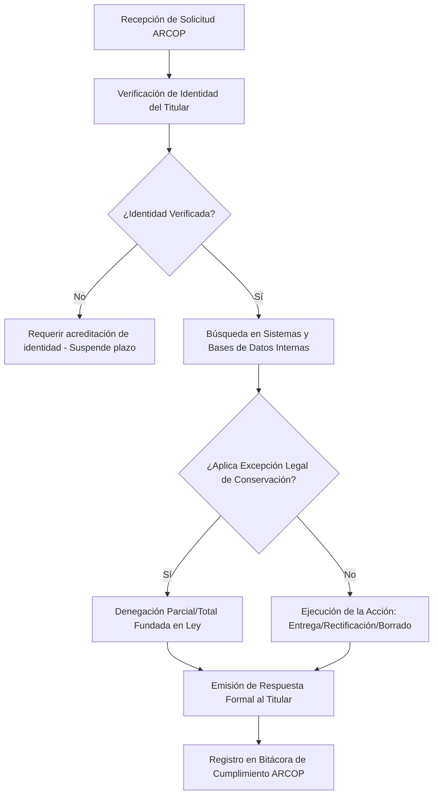

# /dsar-response (Gestión de Derechos ARCOP — Chile)

1. Cargar política de privacidad y registro de actividades de tratamiento (`privacy-legal/CLAUDE.md`).
2. Clasificar el derecho ejercido por el titular: **Acceso, Rectificación, Cancelación (Supresión), Oposición o Portabilidad (ARCOP)**.
3. Verificar la identidad del solicitante y la legitimidad de su personería (titular directo o apoderado con poder especial).
4. Evaluar causales de denegación o excepciones legales (obligación legal de conservación, ejercicio de acciones judiciales, secreto profesional).
5. Computar el plazo fatal de **15 días hábiles** y redactar la resolución/respuesta formal.

---

## 1. El Catálogo de Derechos ARCOP en Chile

| Derecho | Alcance Legal (Nueva Ley de Datos / Ley 19.628) | Obligación del Responsable | Plazo Legal de Respuesta |
|---|---|---|---|
| **Acceso (A)** | Conocer si sus datos están siendo tratados, categorías de datos, finalidades, tiempo de conservación y destinatarios. | Entregar reporte claro y gratuito en lenguaje comprensible. | **15 días hábiles** |
| **Rectificación (R)** | Modificar o completar datos personales que sean inexactos, desactualizados o incompletos. | Corregir el dato y notificar a los terceros cesionarios a quienes se les comunicó. | **15 días hábiles** |
| **Cancelación / Supresión (C)** | Eliminar datos cuando el tratamiento carezca de base legal, haya vencido el plazo de finalidad o se revoque el consentimiento. | Borrado definitivo, bloqueo o anonimización irreversible. | **15 días hábiles** |
| **Oposición (O)** | Oponerse al tratamiento por motivos fundados en su situación particular cuando la base sea interés legítimo o fines de marketing. | Cesar el tratamiento salvo motivos legítimos imperiosos. | **15 días hábiles** |
| **Portabilidad (P)** | Obtener una copia de sus datos en formato estructurado, de uso común y lectura mecánica para transferirlos a otro proveedor. | Exportar en JSON, CSV o XML interoperable. | **15 días hábiles** |

---

## 2. Flujo de Atención y Verificación de Solicitudes



---

## 3. Excepciones Legales a la Cancelación u Oposición

El responsable del tratamiento puede denegar válidamente la cancelación u oposición cuando:
1. **Obligación Legal o Regulatoria de Conservación:** Ej. Conservación de libros de contabilidad y facturas por 6 años (Código Tributario - Art. 17), fichas clínicas por 15 años (Ley 20.584), o antecedentes laborales (Código del Trabajo).
2. **Defensa en Juicio:** Cuando los datos sean necesarios para la formulación, ejercicio o defensa de reclamaciones judiciales, administrativas o arbitrales.
3. **Ejecución Contractual Vigente:** Cuando los datos sean indispensables para el cumplimiento del contrato vigente entre las partes.

---

## Formato de Carta de Respuesta Formal ARCOP

```text
Santiago, [Fecha]

Señor/a
[NOMBRE DEL TITULAR DE LOS DATOS]
Correo electrónico: [correo@titular.cl]

REF.: RESPUESTA FORMAL A SOLICITUD DE EJERCICIO DE DERECHO DE [ACCESO / RECTIFICACIÓN / CANCELACIÓN / OPOSICIÓN / PORTABILIDAD].

Estimado/a señor/a [Apellido]:

Por medio de la presente, en respuesta a su solicitud ingresada con fecha [DD/MM/AAAA] mediante la cual ejerció su derecho de [Nombre Derecho] respecto de sus datos personales en posesión de [NOMBRE DE LA EMPRESA / RESPONSABLE], cumplimos con informar a usted lo siguiente:

1. ACREDITACIÓN Y ALCANCE
Habiéndose verificado satisfactoriamente su identidad, hemos procedido a la revisión exhaustiva de nuestros repositorios de datos y sistemas de tratamiento.

2. RESOLUCIÓN DE LA SOLICITUD
[OPCIÓN A - ACOGIDA TOTAL]: Cumplimos con informar que su solicitud ha sido acogida íntegramente. [Se adjunta reporte de datos / Se confirma la supresión definitiva de los registros / Se acompaña archivo interoperable para portabilidad].

[OPCIÓN B - DENEGACIÓN FUNDADA / PARCIAL]: Cumplimos con informar que respecto de [especificar datos], su solicitud no puede ser atendida en virtud de [citar obligación legal, ej. Art. 17 del Código Tributario / conservación de antecedentes laborales], manteniéndose bloqueados únicamente para dichos fines de cumplimiento legal.

3. DERECHO DE RECLAMACIÓN
Le informamos que de conformidad con la Ley de Protección de Datos Personales, si usted estima que su solicitud no ha sido satisfecha conforme a derecho, tiene la facultad de interponer una reclamación ante la Agencia de Protección de Datos Personales dentro del plazo legal.

Le saluda atentamente,

[NOMBRE DEL OFICIAL DE PROTECCIÓN DE DATOS / REPRESENTANTE]
[NOMBRE DE LA EMPRESA]
```
